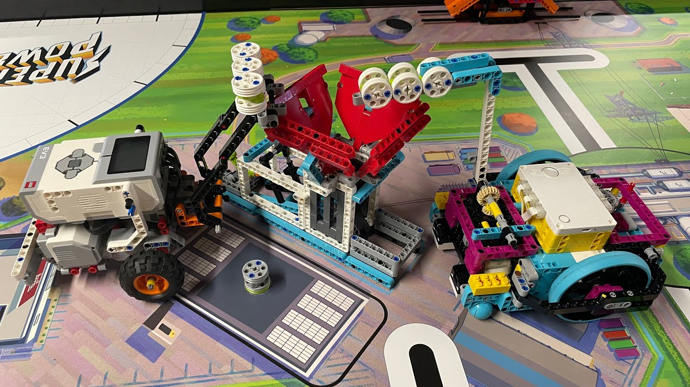

Last weekend, I went to Macquarie University to pick up my daughter from a school event. Little did I know, the day would turn into an exciting experience, filled with innovation, creativity, and the infectious energy of young minds. My daughter's school team had just qualified for the **FIRST LEGO League (FLL) National Finals**, and I had the opportunity to witness the regional event firsthand. It was a moment of pride and awe, not just for our team but for everyone involved.

The journey to the event was easy and smooth. Macquarie University, with its spacious campus and friendly atmosphere, made for a perfect venue. But the real excitement began when we arrived at the event hall. The **Superpowered Season** had drawn participants and spectators from across the region, and the atmosphere was electric. It's always wonderful when hard work pays off, and for my daughter's school team, securing another place in the National Finals was a major achievement. They had been practicing for months, meticulously fine-tuning their robot, rehearsing their project presentations, and refining their core values as a team.

## Youth and Volunteers: The Heart of the Event

One of the first things that struck me was how well the event was organized. From the registration desk to the competition arena, everything ran smoothly, thanks in large part to the many volunteers. Most of them were high school or university students themselves, which made their dedication even more impressive. I was amazed by their energy and willingness to help: whether they were guiding teams to their next challenge or making sure everything was running on time, they kept the spirit of the event alive.

The participants, mostly between the ages of 9 and 16, were equally impressive. I saw teams of young kids who were not only deeply involved in coding and engineering their robots but also fully engaged in the core values of FLL: teamwork, innovation, and a sense of community. The sight of kids working together, supporting one another, and cheering for other teams showed the spirit of collaboration that FLL fosters.

## A Hall Packed with Joy and Excitement

The competition hall was alive with excitement. As I entered, I could immediately feel the buzz of joy and anticipation. Teams huddled together, strategizing their next move, while parents and spectators looked on with pride and admiration. Every now and then, the sound of cheering erupted as a robot successfully completed a mission on the game board. For many of these young participants, this was their first major competition, but they approached it with a level of professionalism and sportsmanship that was inspiring.

Despite the high stakes, the event wasn't just about winning. It was clear that every team was enjoying the process: whether their robots performed perfectly or encountered challenges, the students celebrated their accomplishments, learned from their mistakes, and, most importantly, had fun.

## My First Time Watching the FLL Robot Game

This was my first experience witnessing an FLL robot game up close, and I have to say, it was more thrilling than I expected! The game board was set up with various challenges, each representing a different task that the robots had to accomplish. From delivering cargo to navigating obstacles, the robots, designed and programmed entirely by the students, had to be both precise and agile.

What amazed me the most was the creativity involved. Each team had developed its own unique strategy to complete the missions, showcasing not only their technical skills but also their ability to think critically and adapt under pressure. The robots moved across the board, completing tasks with impressive accuracy, and even when something went wrong, the kids were quick to troubleshoot and fix the problem.

## The Project Showcase: A Platform for New Ideas

In addition to the robot game, another highlight of the event was the project showcase. Each team had to present a project based on this year's theme, **Toy Factory**, which involved identifying a real-world problem and proposing a solution. This part of the competition allowed the kids to demonstrate their research skills, creativity, and innovation.

Walking through the showcase, I was blown away by the variety of ideas. From eco-friendly toys to innovative manufacturing techniques, each team had put a lot of thought into their projects. Some teams focused on sustainability, while others looked at accessibility and inclusivity in toy design. The diversity of ideas was truly inspiring, and it was clear that the FLL is not just about building robots, it's about fostering a passion for solving real-world problems.

## A Day to Remember

As the event came to a close, the excitement didn't fade. For my daughter and her team, the day ended on a high note, as they celebrated their well-earned place in the National Finals. But beyond the trophies and accolades, what stuck with me the most was the sense of community that the FLL fosters. It's an event that brings together students, parents, educators, and volunteers, all united by a shared love for learning, innovation, and collaboration.

Watching the kids engage with such complex challenges gave me hope for the future. The skills they are learning through FLL, from teamwork to problem-solving, will serve them well beyond the competition arena.

This was my first time attending an FLL event, but it certainly won't be my last. Whether or not my daughter's team wins the Nationals, I'm just proud to be part of a community that supports and celebrates the brilliance of young minds.

For anyone who hasn't yet experienced an FLL competition, I highly recommend it! it's a reminder that the future is in good hands.
