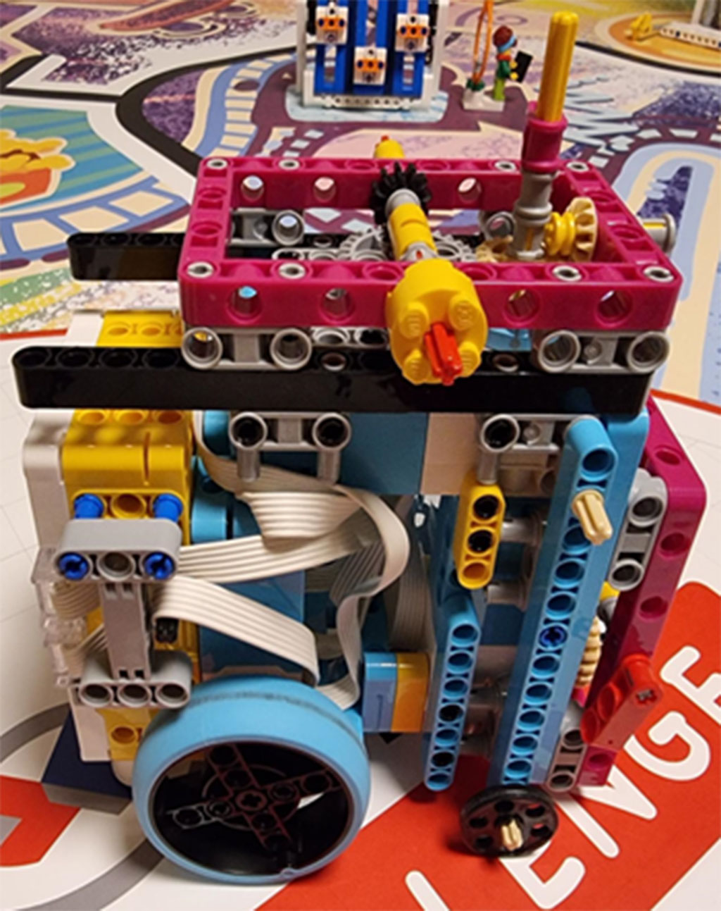
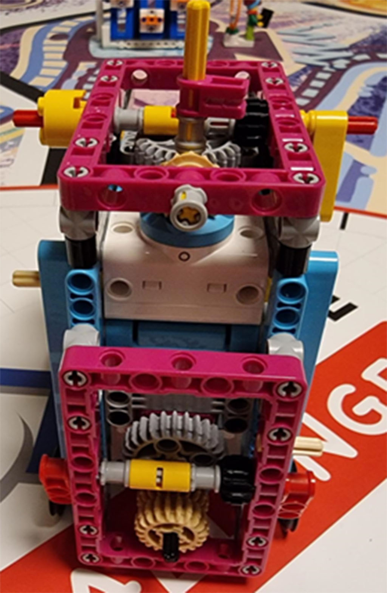

We have a `plan of attack` for our robot game this time! We're aiming to score 300 points if everything works out. But as we know, things just don't always go as planned.

To improve our robot's performance, we've focused a lot on engineering control and handling misalignments during movement. We've prepared code that can handle big errors in movements caused by attachments. By writing robot code that anticipates unexpected situations, we can make on-the-fly adjustments during the game.

Our first template of Python code started to work with lots of help from our coach. We used functions to simplify our robot's movements in coding, which made it easier to manage and debug. Incorporating the gyro sensor has been a game-changer for us, assisting with precise turning and moving.

We've spent countless hours practicing to make every action accurate. Sometimes, we have to redo all the coding just to improve by a few seconds. It's a tedious process, but those few seconds can make a significant difference in the competition.

By focusing on precision and reliability, we're hoping to make our robot more consistent during the game. It's been a challenging process, but we're excited to see how our efforts pay off. Fingers crossed for a successful run!

