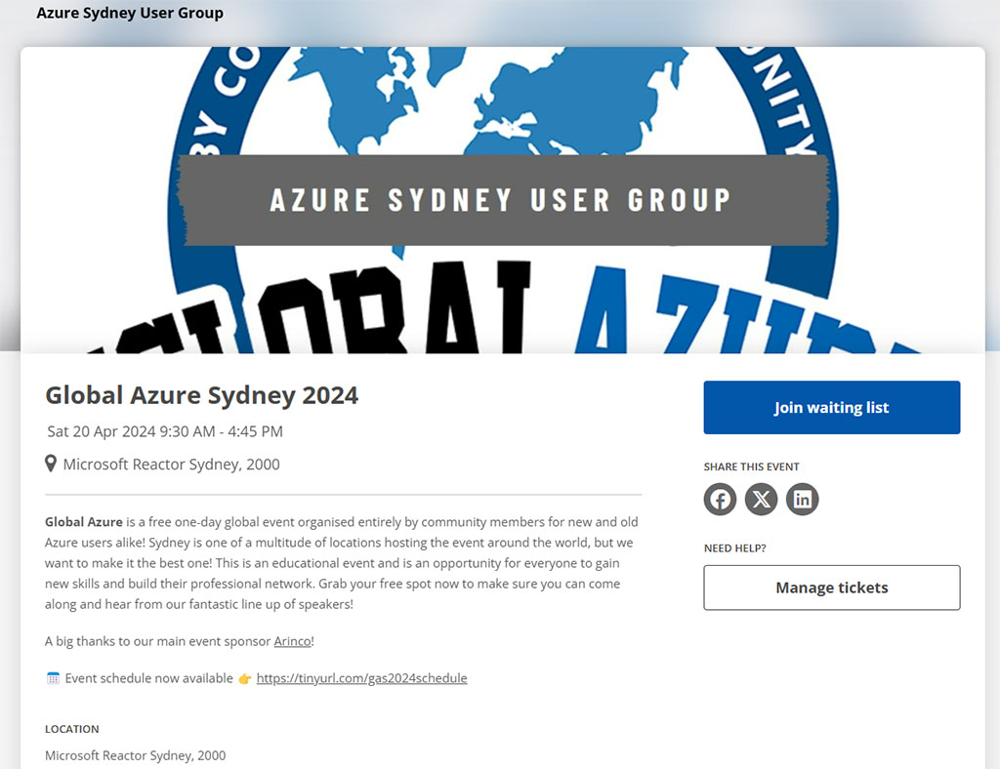
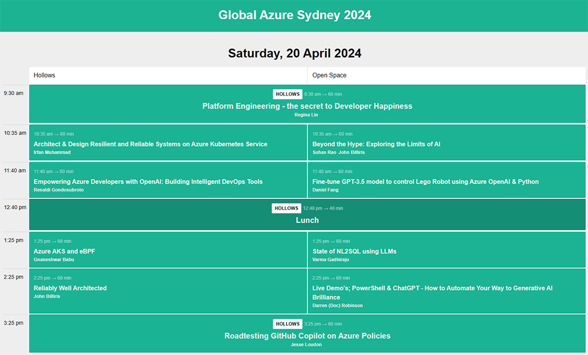

Join me for an exciting session where we'll have some fun with Lego SpikePrime Robot and AzureOpenAI. I'm proud to be presenting at Global Azure Sydney 2024 - Microsoft Reactor Sydney @ 20/04/2024.

📌 Session: Fine-tune GPT-3.5 model to control Lego Robot using Azure OpenAI & Python
🗣️ Speaker: Daniel Fang

Session details: https://sessionize.com/view/rjfzv8k0/GridSmart?format=Embed_Styled_Html&isDark=False&title=Global%20Azure%20Sydney%202024
Reserve your spot: https://www.tickettailor.com/events/azuresydneyusergroup/1193113

  

    
  

  

    
  

  

    
  

  

    
  

<a href="https://www.linkedin.com/posts/qkfang_lego-spikeprime-azureopenai-activity-7181600326196637696-QxS8" target="_blank">Read more via LinkedIn Post</a>
