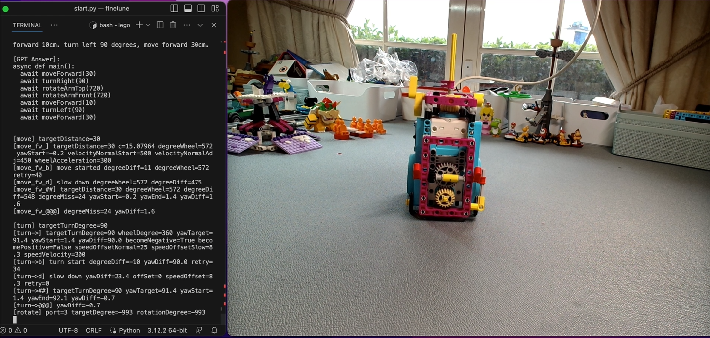

Over the last 12 months, I've been amazed by all the developments happening in the AI world. From advancements in natural language processing to AI-driven coding tools, it's clear that AI is transforming the tech landscape faster than ever. With all the buzz, I decided to set a challenge for myself: to build an AI app from scratch.

I've heard a lot about is Azure's fine-tuning capabilities. The idea behind fine-tuning is to take a generic AI model and specialize it for a particular task or domain. In my case, I want to see if I can fine-tune a model to improve the accuracy of Python coding snippets, specifically for Spike Prime robots.

Spike Prime is a versatile LEGO robotics kit that allows users to program movements and interactions. While generic Python code can be used to program the robots, I'm curious if fine-tuning a model on Azure can make the code more optimized for Spike Prime's specific needs.

This will be my first time building a fine-tuned model on Azure, so I want to make the process as smooth as possible. Instead of trying to fine-tune every Python function related to Spike Prime, I've decided to narrow the scope and focus only on a few scenarios, such as robot movement and turning.

The fine-tuning process for this project looks like this:

1. **Dataset preparation**: Gather Python code snippets that are specifically tailored for Spike Prime, focusing on movement and turning functions.
2. **Fine-tuning**: Use Azure's fine-tuning service to train the model with this specialized dataset.
3. **Testing**: Evaluate the fine-tuned model by inputting generic Python code and observing how it converts the code to a more Spike Prime-specific version.

This is just the beginning, and I'm excited to see what kind of improvements we can achieve. Stay tuned as I dive deeper into the world of AI fine-tuning and robotics!