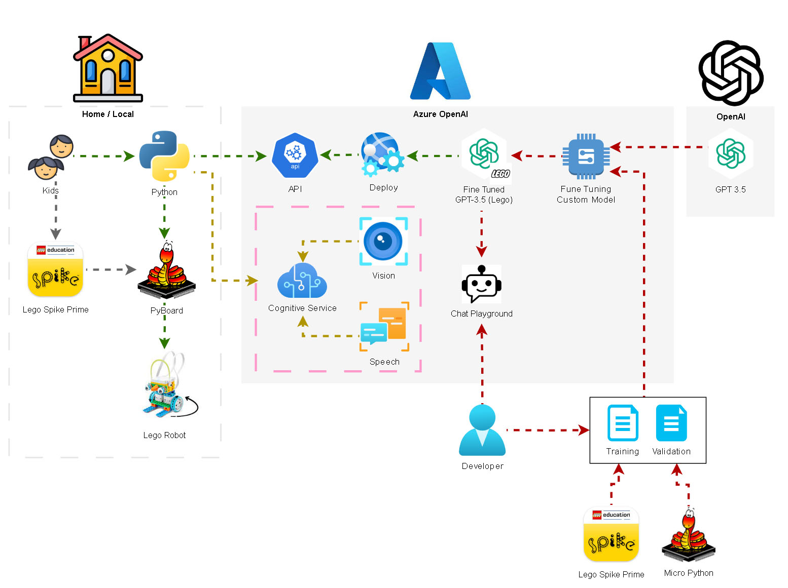

We've made great progress in our journey to fine-tune an AI model for Spike Prime robots. With the training dataset and validation dataset ready, it's time to take the next step: setting up an Azure endpoint and integrating it with our local Python script.

First, we configured the Azure endpoint to allow us to send and receive data. This will enable our fine-tuned model to process instructions in real-time. By doing this, we can interact with the model directly from our local machine, making it easy to integrate AI-powered code suggestions into our Spike Prime project.

For the robot connection, we used a serial port interface. This allowed us to send commands from the Python script running on our local machine to the robot in real-time. This setup ensures that we can test and execute movements and commands on the fly.

The results look promising so far. The fine-tuned model has demonstrated an ability to stick closely to the instructions we provided. It seems to understand the specifics of the Spike Prime movement commands, offering more accurate code suggestions than a generic model.

Here's a glimpse of what we've tried so far:

- **Moving forward**: The model was able to generate precise movement commands using Spike Prime-specific syntax.
- **Turning**: We tested multiple turning scenarios, and the model successfully adjusted the turning angle based on the instructions.
- **Combining movements**: The fine-tuned model was able to chain together commands, making the robot perform complex maneuvers smoothly.

The integration between Azure and our local environment is working well, and the fine-tuned model is proving to be a valuable tool in generating Spike Prime-specific Python code. As we continue to refine the model, I'm excited to see how far we can take it!
