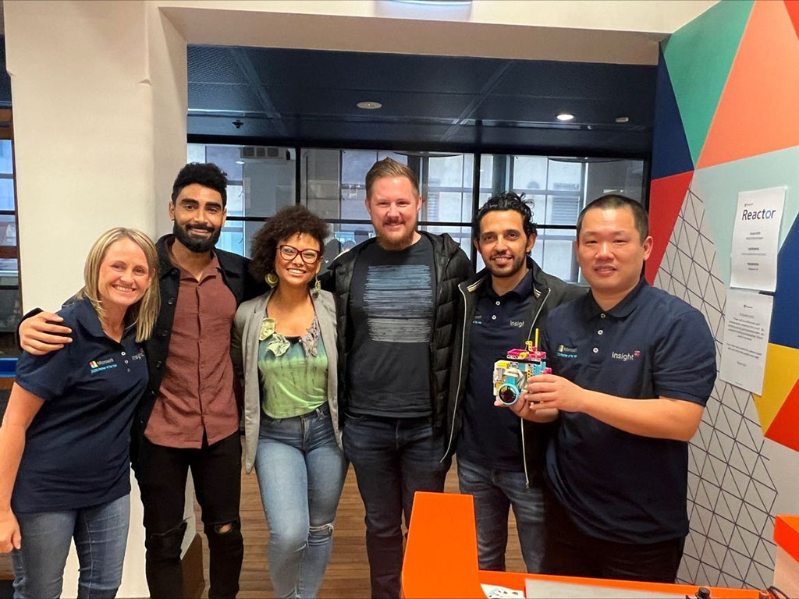

I'm excited to share that today I had the incredible opportunity to attend the **Global Azure Sydney 2024** user group session at the Microsoft Reactor today! Even more thrilling, I got to present my experiences with AI and coding during the event. It was an amazing moment to share my journey, including how I've been exploring AI model fine-tuning and integrating it with robotics like Spike Prime. Feeling grateful for the chance to connect with so many passionate people in the field and exchange ideas!

Here's a quick overview of my talk and some key takeaways:

- **The Power of AI in Code Generation**: I dive into how I've been using Azure's fine-tuning to create more efficient, domain-specific code for robotics.
- **From Generic Python to Robot-Specific Commands**: I shared my experience building models that turn general Python code into Spike Prime-specific instructions.
- **Azure Endpoint Integration**: I walked through how to set up and connect an AI model to a local environment, demonstrating real-time interactions with the Spike Prime robot.

You can watch the full session here:  
[**Watch My Azure Global Sydney 2024 Talk**](https://www.youtube.com/watch?v=x_m60Aq3WQQ&list=PLOtGH2i44gAJSADlyKtXNmoYT1W-JNTWS&index=5&t=2501s)  

The feedback I received was beyond amazing! Attendees from all over the world were interested in how AI can assist with robotics programming and coding efficiency. The response from the team at Microsoft was also incredibly positive, sparking some great conversations on future collaborations and projects.

I had a fantastic day at **Microsoft Reactor** in Sydney, a space filled with innovation and learning. The energy was contagious, and I left with so many new ideas and connections.

