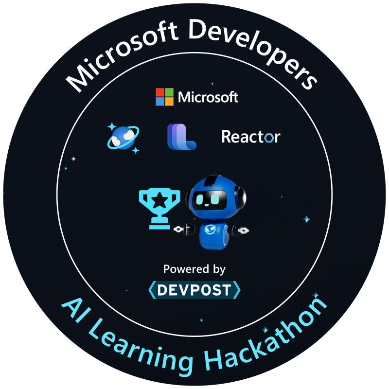

Recently, I came across the **Microsoft Azure OpenAI Hackathon** and couldn't resist giving it a go! With the help of the detailed online instructions, I was able to follow along easily and dive into some really exciting AI technologies. The step-by-step tutorial provided a smooth learning experience, making the whole process engaging and informative.

During the hackathon, I gained valuable knowledge on several key technologies:

- **Cosmos DB**: I learned how this scalable database can store and manage massive amounts of data, which is perfect for AI applications.
- **LangChain**: This framework helped me understand how to integrate language models into real-world applications, particularly with the help of APIs and external data.
- **RAG (Retrieval-Augmented Generation)**: This was one of the most interesting parts! I built a chatbot that retrieves information from a knowledge base to give more accurate and relevant responses, blending both AI generation and data retrieval.

The experience got me thinking: how can I apply a similar approach to improve AI coding for **LEGO Spike Prime robots** using Python? Could we potentially use tools like Cosmos DB, LangChain, and Retrieval-Augmented Generation to enhance the way robots process commands and interact?

Imagine a chatbot-like interface for programming robots, where the AI retrieves the most efficient and specific commands from a knowledge base to guide the robot's movements and tasks. It opens up a world of possibilities! Could we fine-tune a model that combines language generation with real-time data, and use it to make robotics coding smarter and more intuitive?

The hackathon has definitely sparked some new ideas for how we can push the boundaries of AI-powered robotics programming. I'm eager to explore these possibilities further and see how we can take our LEGO robot AI coding to the next level!

**Update: got my completion badge!**

