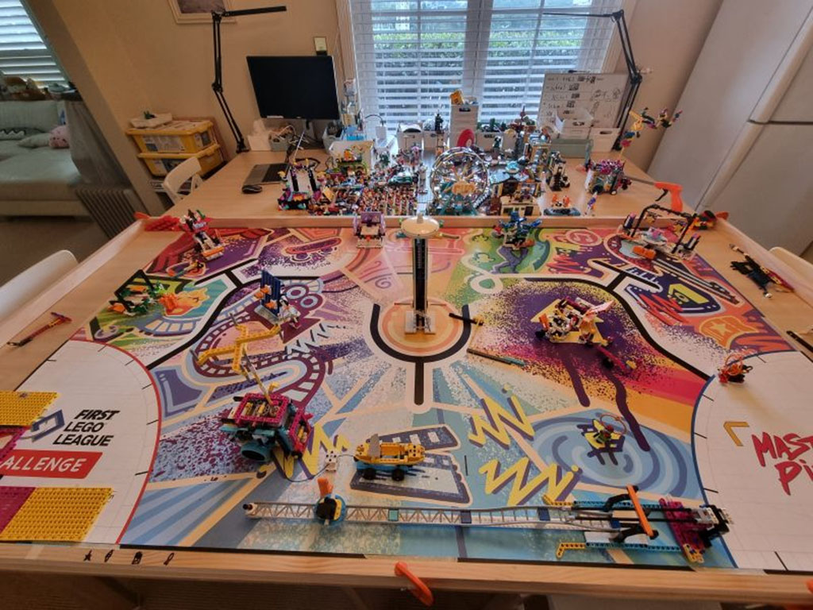

Hooray! 🎉 Our girls' FIRST LEGO League team is heading to the Asia Pacific Open Championships (APOC https://www.firstaustralia.org/asia-pacific-open-championships) this July! 

It's been an incredible journey through last year's regional and national competitions. As their coding mentor (still learning my ways), I rebuilt the FLL competition table at home for their extra Robot Game practice over the weekends. 

🌏Now, it's the time for international! 

  

    
  

<a href="https://www.linkedin.com/posts/qkfang_fll-firstaustralia-lego-activity-7205078299151081472-S9D4" target="_blank">Read more via LinkedIn Post</a>

