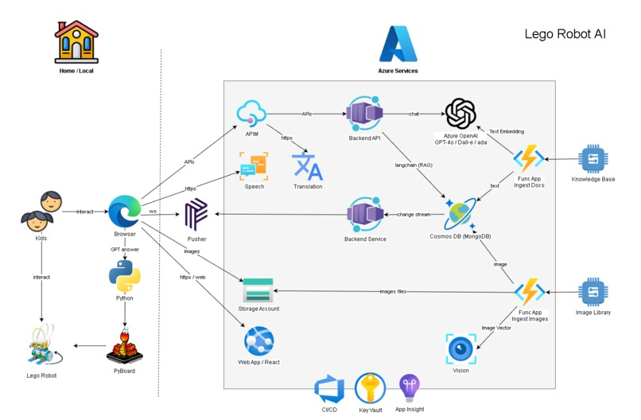

The closing day of the **Microsoft Azure OpenAI Hackathon** is fast approaching, and I've just wrapped up **Phase 2** of my project. It's been an exciting journey, and I've managed to add some really cool features that have made the chatbot even more powerful.

Here's what I've built on top of the base RAG chatbot using more Azure AI Services:

- **Voice Interaction**: The chatbot can now accept voice commands, making it more interactive and user-friendly, especially in hands-free scenarios. This adds a whole new level of accessibility to the project.
- **Speech Output**: In addition to text-based responses, the chatbot can now speak back the generated Python code or explanations. This is particularly useful for quick feedback or demonstrations.
- **Language Translation**: I integrated a translation feature, allowing the chatbot to understand and respond in multiple languages. Whether you're coding in English, Spanish, or any other supported language, the chatbot can assist, making it more versatile and globally accessible.

These enhancements have transformed the chatbot into a more intuitive AI assistant that doesn't just help with coding but also communicates naturally with the user. I'm really excited to see how it performs in the hackathon!

With everything built and ready, it's time to submit the project and see what kind of feedback we get. The hackathon has been a fantastic learning experience so far, and I'm eager to hear what others think of these new features. Let's put the project to the test and see how it stacks up against the competition! Fingers crossed! 🤞

