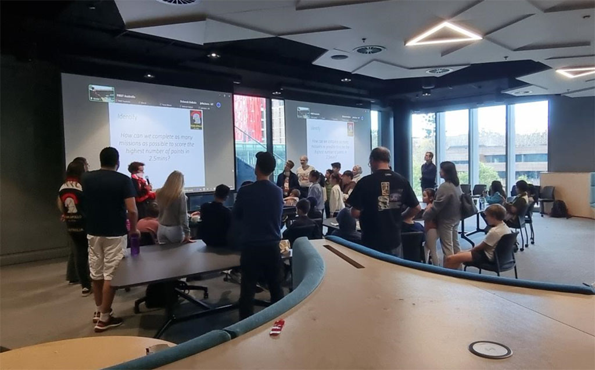

I had the exciting opportunity to present a talk at the *FIRST LEGO League* (FLL) Australia season kickoff in August 2024, an event where young minds gather to prepare for a year full of innovation, teamwork, and, of course, robotics. My talk was titled, "ChatGPT, Write Python Code for My Robot, Please!", A topic that connected artificial intelligence, robotics, and education in a way that resonated with both the kids and mentors.

One of the most exciting things to prepare for this talk was building up a Python knowledge base specifically for the LEGO SPIKE Prime, the popular robotics kit used in FLL. SPIKE Prime uses a powerful hub and motors that can be programmed in Python. By leveraging ChatGPT's advanced language model and training it with SPIKE Prime's API and specifications, I was able to get it to generate Python code that effectively controls the robot's movements and sensors. This is a great option for kids (and even adults) who might struggle with the initial complexities of writing code from scratch.

For example, using simple natural language prompts like "write Python code to move the robot forward for 20 cm", ChatGPT can now produce highly accurate, ready-to-run Python scripts that control the motors of a LEGO robot.

During the presentation, I walked the audience through several real-world examples of how ChatGPT can assist in generating Python code for SPIKE Prime robots. I showed how, with minimal guidance, the AI could create scripts that made the robot move forward, turn, stop, and even detect objects using sensors. The kids were thrilled to see how a few simple prompts resulted in real-time robot movement, and their imaginations lit up at the possibilities of using AI to enhance their learning and problem-solving.

One key aspect of my talk was addressing the responsible use of AI as a learning tool. I emphasized how tools like ChatGPT should not be seen as a shortcut or replacement for understanding core concepts but rather as a tool to enhance learning. I encouraged the kids to experiment with the AI, ask it questions, and use it to break down complex problems, but to also remain curious about how the code works. This way, they could continue learning and developing their own skills while benefiting from the AI's assistance.

To make the talk even more engaging, I introduced two major figures in the tech world: Satya Nadella, CEO of Microsoft, and Sam Altman, CEO of OpenAI. I explained their roles in the development of AI and how their vision has contributed to making these cutting-edge technologies more accessible to everyone. The kids were fascinated to learn about the real people behind the tools they were interacting with and how AI is evolving to shape the future of not just robotics, but many industries.

The talk was super fun! The combination of showing how AI can be a practical, hands-on tool for robotics, while also discussing the broader implications of responsible AI use, made it a well-rounded experience. Watching the kids' excitement as they saw the robots come to life through AI-generated code was a highlight, and I hope they left feeling empowered to continue exploring the amazing world of robotics and AI.
