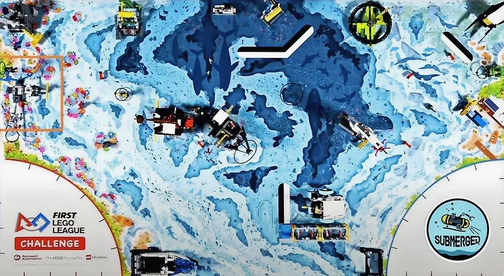
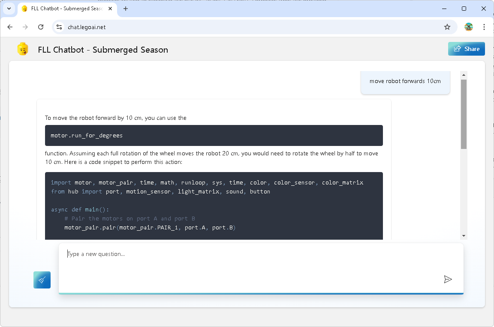

In the new *Submerged* season of FIRST LEGO League (FLL), we are continuing our journey of using AI to help us learn, innovate, and make robotics more accessible to everyone. Our team took the initiative to build a chatbot using Microsoft Azure (with lots of helps from coaches) and publish an app that anyone can use, free of charge. This was a big step toward creating a more inclusive, cost-effective way for young engineers and coders to get the most out of AI.

One of the challenges we faced when using tools like ChatGPT is that they often require users to create an account, and there are costs associated with using advanced AI features. This creates a barrier for many students and teams who might not have access to these resources. To solve this, we built a free version of our chatbot that specifically focuses on the needs of FLL participants. We locked down the scope of the questions and answers so that they only relate to the official season documents and guides for the *Submerged* challenge, as well as coding instructions for the LEGO SPIKE Prime 3.

The chatbot is designed to be simple and focused, giving users clear, relevant information about the FLL challenge and the Python coding required for SPIKE Prime 3 robots. Whether a team needs help understanding the mission details or figuring out how to make their robot move in a specific way, our chatbot has the answers.

One of the key skills we emphasized this season is *prompt engineering*. The art of asking the right questions to get the best answers from an AI. While many people assume that AI automatically gives perfect responses, the truth is that how you ask a question can dramatically affect the quality of the answer you receive. We've been teaching our team and users of the chatbot how to frame their prompts clearly and concisely to get more accurate and useful information.

For example, instead of asking, "How do I code my robot?" a better prompt might be, "Write Python code to move my SPIKE Prime 3 robot forward for 5 seconds and stop." By being specific, users can get actionable responses that directly help with their projects.

This new chatbot, combined with prompt engineering techniques, empowers young engineers to not only rely on AI for quick solutions but also to better understand how to interact with technology in ways that enhance their learning experience. We're excited to see how teams use this tool during the *Submerged* season and how it helps them innovate and succeed. We hope to remove some of the barriers that traditionally come with using advanced AI tools and give every FLL team a chance to harness the power of AI for their robotic challenges.
