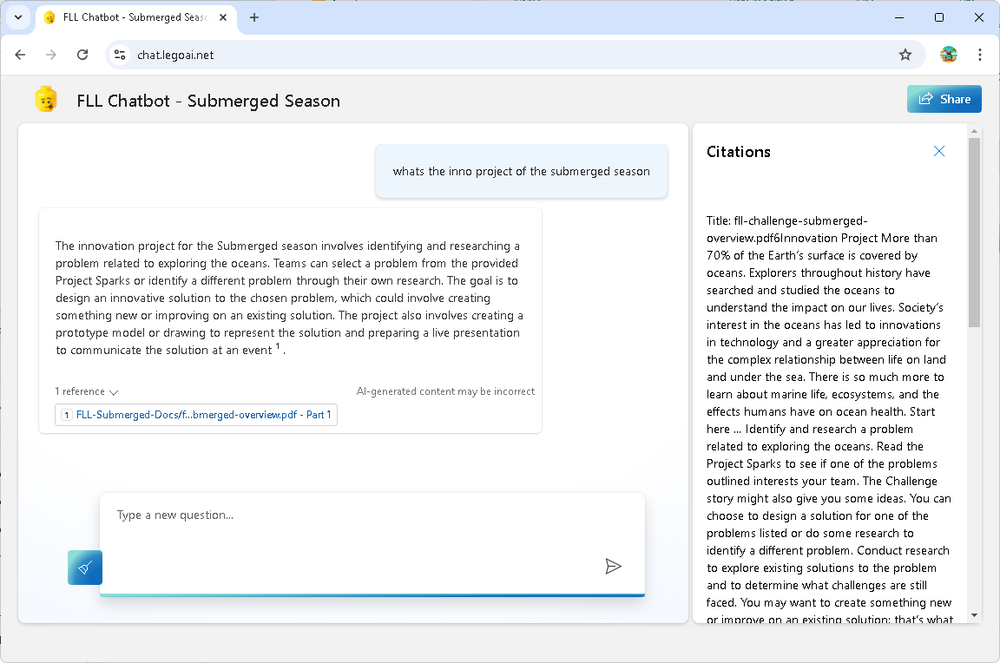

In this FLL season, we decided to take our chatbot project to the next level. On top of helping us with coding for the LEGO SPIKE Prime, we wanted to explore if we could add all the season documents into the chatbot to help with research and navigating through the rules of the robot game. The idea was to make it easier for our team to access and understand the challenge, rules, and guidelines, all in one place, through a simple conversation with the bot.

To do this, we downloaded all the essential documents: PDFs, excel spreadsheets, PowerPoints from the FIRST LEGO League website. These documents contain all essential information about the *Submerged* season, including robot game rules, mission details, and field setup instructions. We then uploaded everything to our Azure storage account, which made it easy to connect the documents with our chatbot.

Using Azure, we linked the chatbot with the documents so it could answer questions related to the robot game rules and season guidelines. For example, if we needed to know what specific missions required or how points were awarded, we could ask the chatbot, and it would pull the information directly from the official documents.

The setup process on Azure turned out to be more straightforward than we anticipated using Azure AI Studio. Azure provides great tools for building, training, and deploying AI models, and we were able to get our chatbot running smoothly in a short amount of time. It was a valuable learning experience to see how cloud-based AI services like Azure work in real life. With this setup, our chatbot became a research assistant, helping us quickly reference complex rules and documents during our robot strategy sessions.

We are also keen on responsible AI during our learning. This season, we had sessions with students on *AI bias* and *responsible AI* use, which were critical in shaping how we approached this project. We taught the students that while AI can be incredibly powerful, it's also important to recognize its limitations. It's not just about getting the right answer; it's about understanding how the AI processes information and ensuring it's providing accurate and unbiased responses.

We talked about how bias can creep into AI models, especially when the data or documents they rely on are incomplete or misinterpreted. By being cautious and ensuring we used the chatbot as a support tool rather than the sole decision-maker, we are ready to explore AI's potential responsibly.

We're excited to continue using our chatbot for coding, research, and game strategy while keeping in mind the lessons we've learned about using AI. Our team is ready to dive into the *Submerged* season with confidence, knowing we have the tools and understanding to make the most of AI without losing sight of what's most important: learning, teamwork, and innovation.
