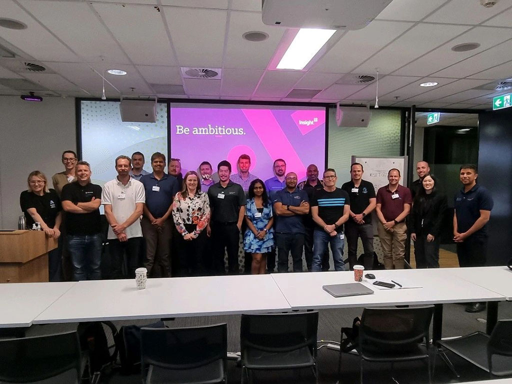
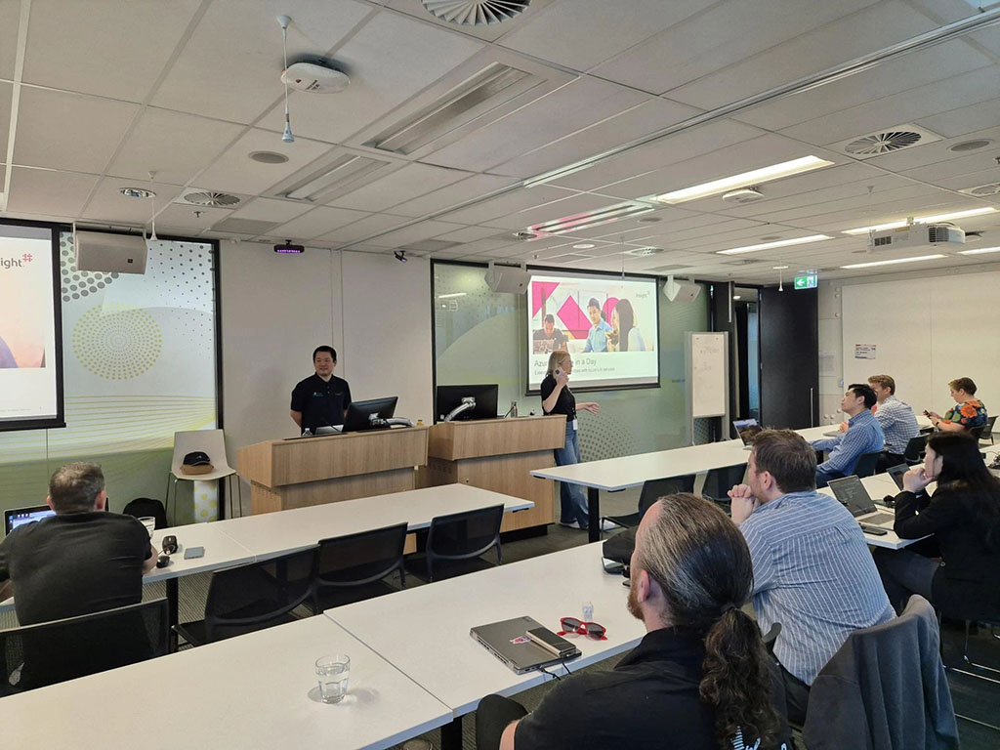
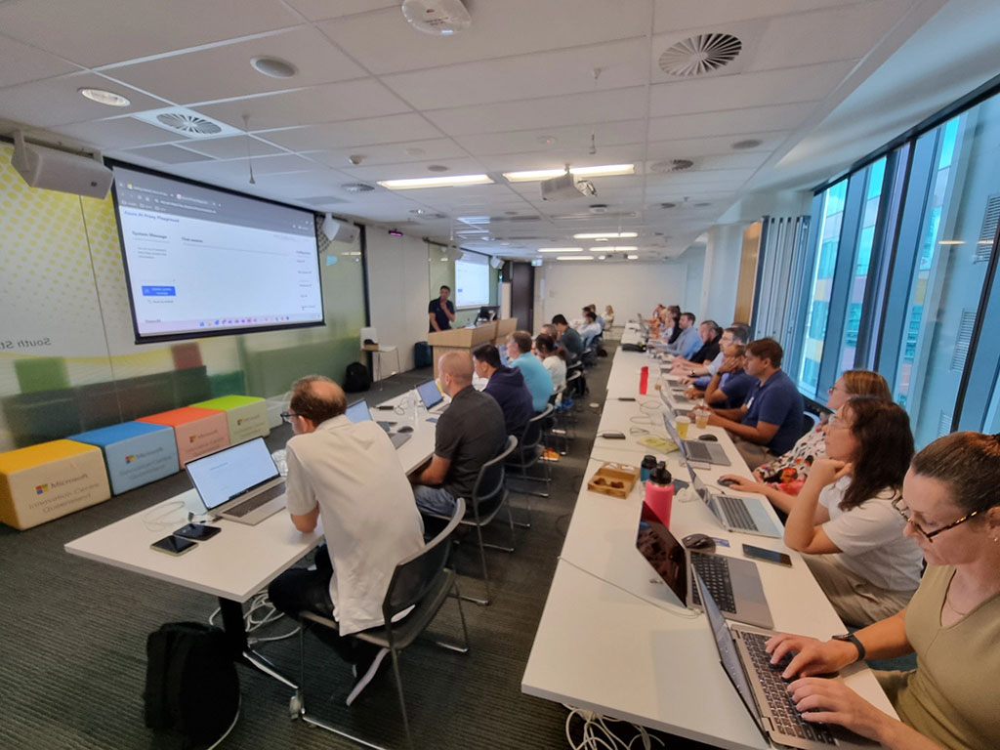
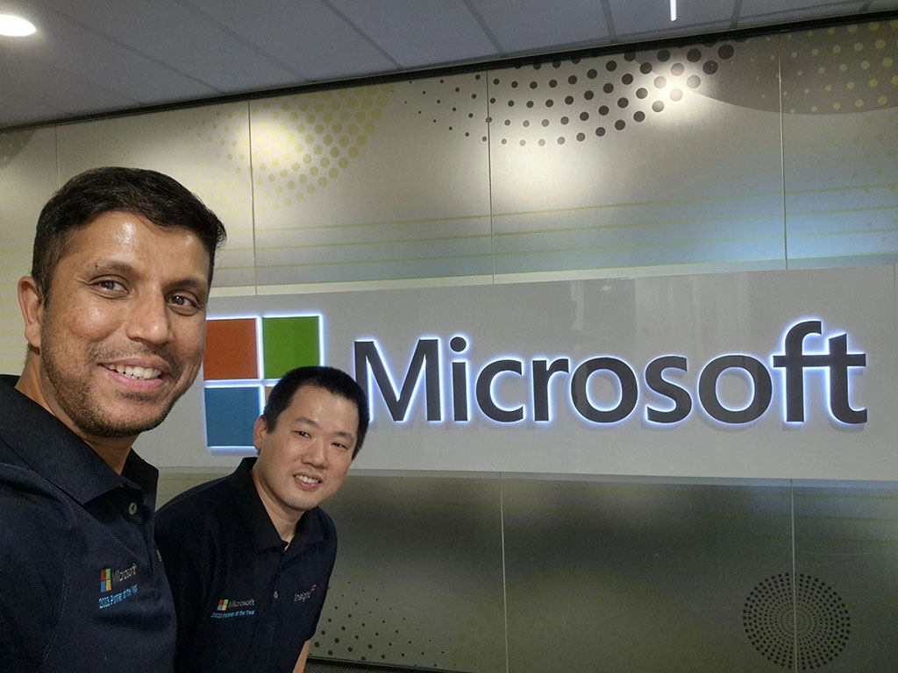

We are back at Microsoft Brisbane office again for our second Azure AI App in a Day workshop.

Ready to build the next million-dollar app in just a day? 💡 We’ve just completed our second hashtag#AzureAIAppInADay in Brisbane Microsoft office. Rakesh Lakshminarayana and I had so much fun leading the workshop, and we’re glad to see more participants make it to the end - some of you without even a dev background! It’s been amazing to keep the momentum going. A big thank you to Tricia Read and Ross Johnson.

In this workshop, we got hands-on with AI app development, hashtag#RAG (Retrieval-Augmented Generation), prompt engineering and built a chatbot using hashtag#CosmosDb for hashtag#MongoDb. With the power of hashtag#Azure and hashtag#OpenAI, we're helping organizations bring their AI ideas to life!

Excited to see what incredible apps come next! Our Insight team is around to help.

  

    
  

  

    
  

  

    
  

  

    
  

<a href="https://www.linkedin.com/posts/qkfang_azureaiappinaday-rag-cosmosdb-activity-7239964064297197569-b565" target="_blank">Read more via LinkedIn Post</a>

