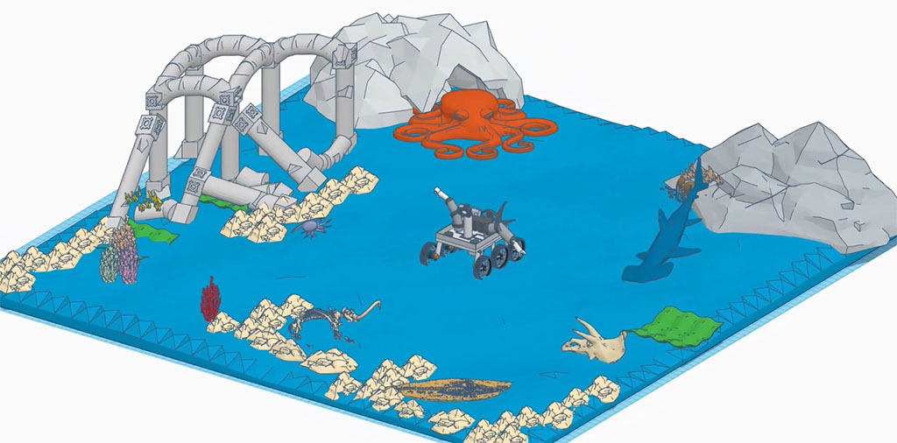
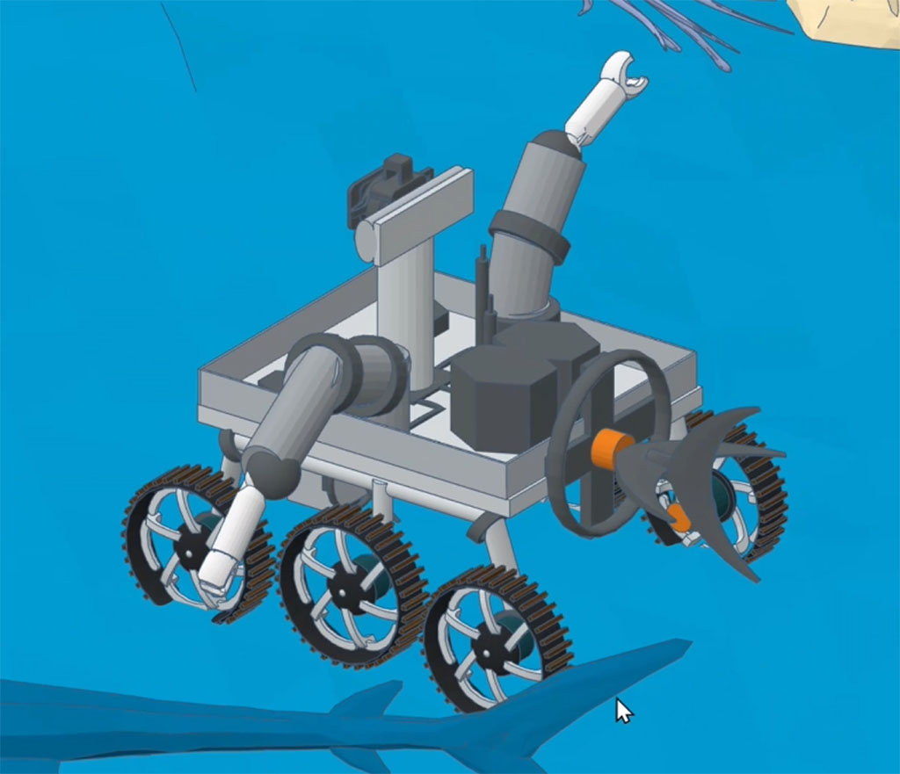
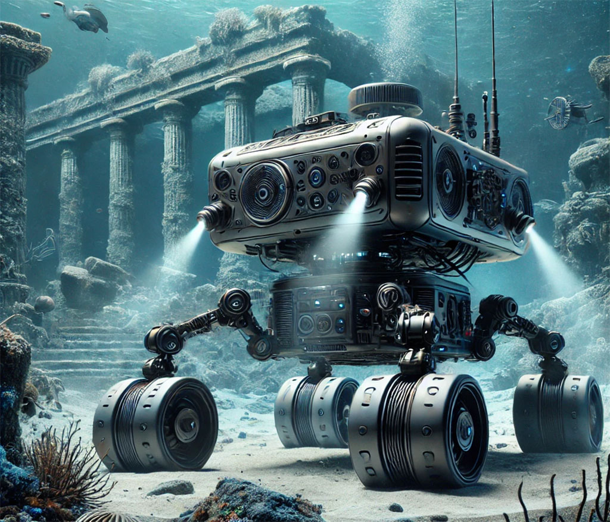

Our Year 7 & 8 team is diving deep into the past with our project for the **FIRST LEGO League Submerged season**! We're developing **BlueBerry**, a deep-sea rover designed to explore the ocean floor 🌊 and uncover ancient civilizations lost to time. Rover BlueBerry will help identify and analyze submerged ruins and artifacts, bringing marine archaeology into the future.

  

    
  

## What Makes "BlueBerry" Special?
- **Eco-Friendly Design**: We're committed to minimizing our rover's environmental impact on delicate marine ecosystems.
- **Real-World Potential**: We aim for BlueBerry to be a tool for professional marine archaeologists, aiding in real discoveries.
- **AI-Powered Discovery**: BlueBerry uses AI to recognize archaeological finds and send real-time data to researchers on the surface.

## Preparing for Competition & Seeking Expert Advice
As we gear up for the **regional competition**, we're fine-tuning BlueBerry's design and capabilities. We'd love insights from LinkedIn experts—whether in robotics, AI, or marine archaeology. 

- **What challenges** should we expect with underwater exploration?
- **How can we enhance BlueBerry's AI** for more accurate artifact detection?

## 3D Model and Landscape

We've designed a 3D model and are ready to print it!

We also uploaded the model to GPT-o1 for suggestions, and the improvements are incredibly futuristic!

  

    
  

  

    
  

We're excited to learn and grow from your feedback! Follow our journey as we bring history to life, one dive at a time. 🌊

