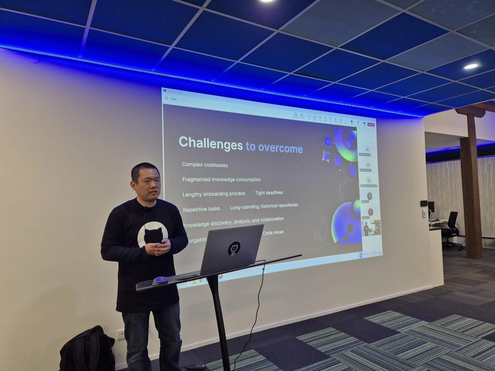

It was an incredible GitHub Copilot Hackathon with the amazing developers in Auckland! The passion and energy in the room were off the charts as we dove headfirst into exploring the potential of GitHub Copilot! 🚀 From supercharging our coding workflows to discovering how AI can elevate our development game, this hackathon truly showcased the future of dev innovation.

GitHub Copilot, Microsoft's AI-powered coding assistant, was the star of the day, sparking excitement as developers explored its potential. From optimizing complex code structures to generating intelligent suggestions, Copilot proved to be a game-changer for boosting productivity and creativity in development.

The atmosphere was electric with collaboration and creativity as teams worked together to push the limits of what AI can do for coding. Participants came with unique perspectives, and it was amazing to see how their diverse backgrounds fueled some truly innovative ideas. Whether we were optimizing workflows or discussing new ways to streamline repetitive coding tasks, the energy in the room showed just how much potential AI has in transforming the way we develop software.

As we look ahead, it's clear that today was just the beginning. The potential of GitHub Copilot and AI-driven tools in development is immense, and we're only scratching the surface. From increased productivity to smarter, more efficient coding solutions, the future of development has never looked more exciting!
