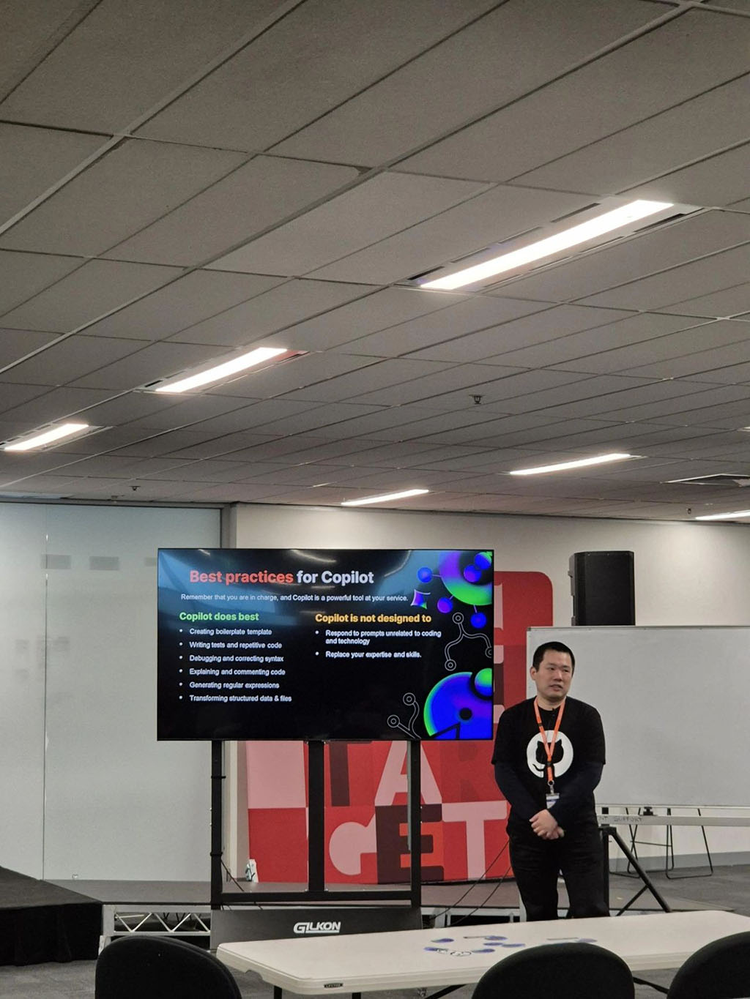

🚀 EPIC 'Excitement day' at Kmart Australia Limited HQ! Insight hosted two sessions of hands-on labs with the fantastic Kmart team, diving into the wonders of hashtag#GitHub hashtag#Copilot. The energy was off the charts! From seasoned pros to adventurous coders, everyone was excited to see how copilot could boost our day to day coding experience. We explored C#, Java, Node.js, React, Terraform and even classics like hashtag#COBOL and hashtag#BASIC! 💻

A huge shoutout to Duane G. Sachin Walia for making this event such a blast, and Microsoft GitHub for making it happen. The excitement in the room was contagious, and we can't wait to see how Copilot will boost efficiency and ignite innovation! 💡 

  

    
  

  

    
  

  

    
  

  

    
  

  

    
  

  

    
  

  

    
  

  

    
  

<a href="https://www.linkedin.com/posts/qkfang_github-copilot-cobol-activity-7250226689945808897-HFVE" target="_blank">Read more via LinkedIn Post</a>