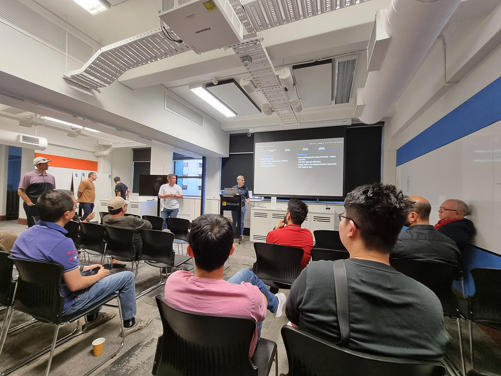
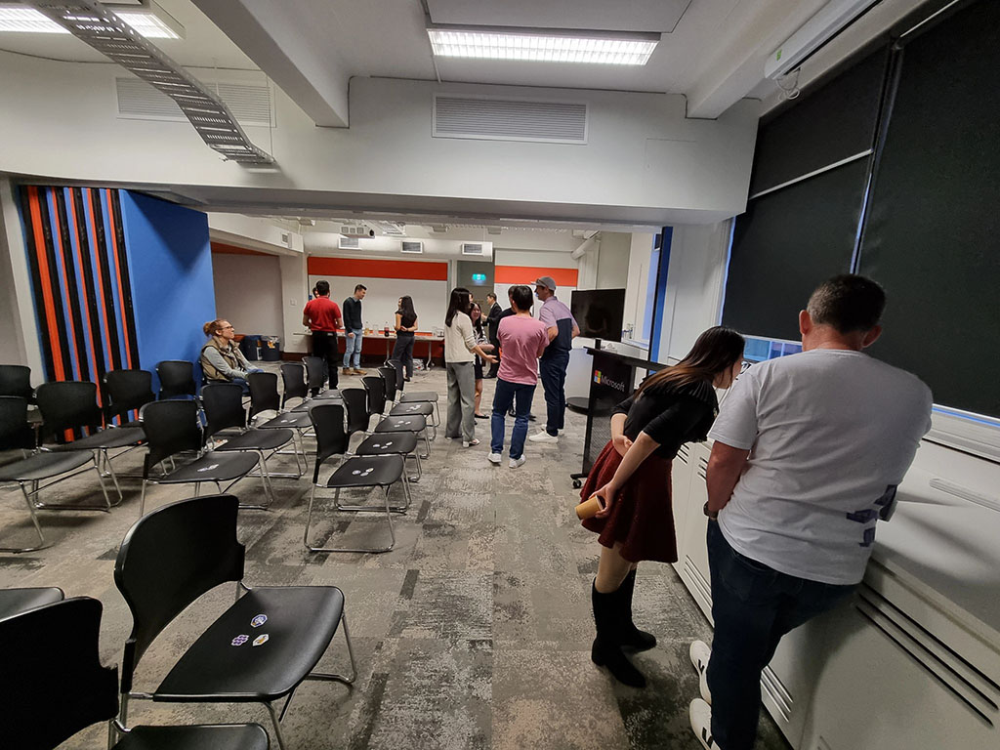

An amazing session from AKS product team about the new features of Azure Kubernetes Service at Microsoft Reactor Sydney tonight! It's an insightful presentation and demo from Justin on running open source LLMs in AKS using the AI toolchain operator (KAITO) - a perfect blend of AI and Kubernetes in action! 

Fantastic opportunity to hear directly from the team. Great to see Simon and Jorge and the visiting product managers Brian and Kaysie for such an engaging event. Read more about KAITO: https://learn.microsoft.com/en-us/azure/aks/ai-toolchain-operator

Great pizzas too! 🍕

  

    
  

  

    
  

<a href="https://www.linkedin.com/posts/qkfang_aks-kaito-ai-activity-7252601527989645313-nVbV" target="_blank">Read more via LinkedIn Post</a>
