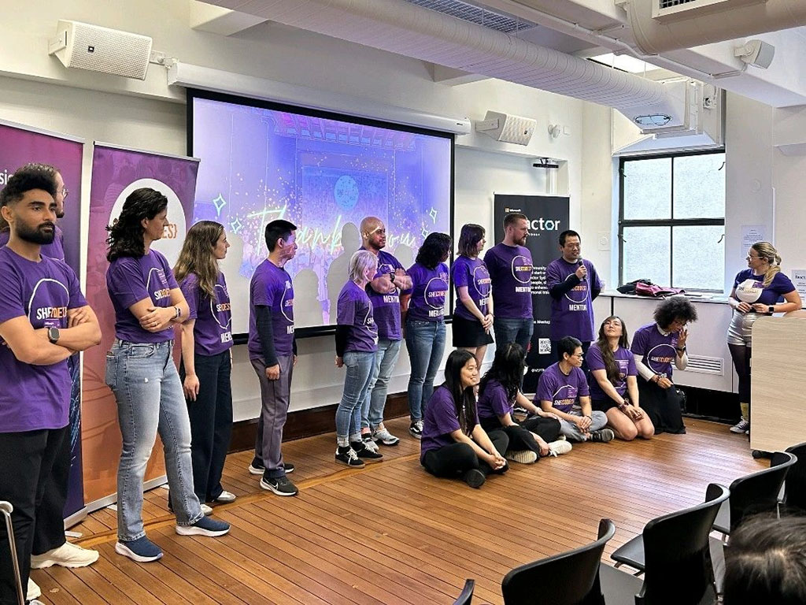

🌟 Incredible day at She Codes Australia Sydney workshop yesterday at Microsoft Reactor! A huge shout-out to Kate and her team for putting together this amazing event, bringing so many women into the world of tech. 💻

The day was filled with inspiration, especially the powerful stories shared by the guest speakers: Catia and Laura. Catia started her journey with a teacher degree, took a gap year traveling to 50+ countries, speaks four languages, and now manages major clients around the world at Insight 🌏. Laura began with a vet degree, pursued her passion for math and statistics, and has now grown into a Data Science and AI Area Lead at Commonwealth Bank.

The energy in the room was electric, with two rooms filled with passionate participants and mentors, all working together to inspire and empower.✨

It was my first time mentoring at SheCodes, seeing so much talent, collaboration, and enthusiasm was truly inspiring! Lovely to see Catia, Ollie, Angela, Nilesh, Lisa, Athena in the room.

  

    
  

  

    
  

  

    
  

  

    
  

  

    
  

  

    
  

  

    
  

Looking forward to the next event and continuing to support women on their tech journey! 🚀

<a href="https://www.linkedin.com/posts/qkfang_incredible-day-at-she-codes-australia-activity-7253626870993170432-2nfv" target="_blank">Read more via LinkedIn Post</a>

