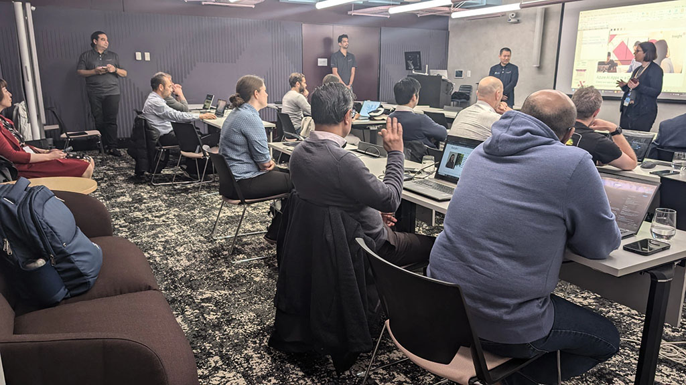
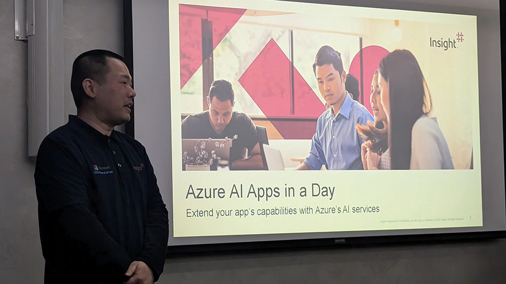

Incredible Microsoft AI AppinaDay Workshop in Wellington, my first time to the lovely city!

It's fantastic to see so much enthusiasm in the room as we dive into the capabilities of Azure AI services. The questions and engagement from everyone attending are truly impressive. Really great running the session with my Insight teammates Ross and Ajay!

  

    
  

  

    
  

  

    
  

<a href="https://www.linkedin.com/posts/qkfang_ai-appinaday-activity-7257612486785314818-haBx" target="_blank">Read more via LinkedIn Post</a>

