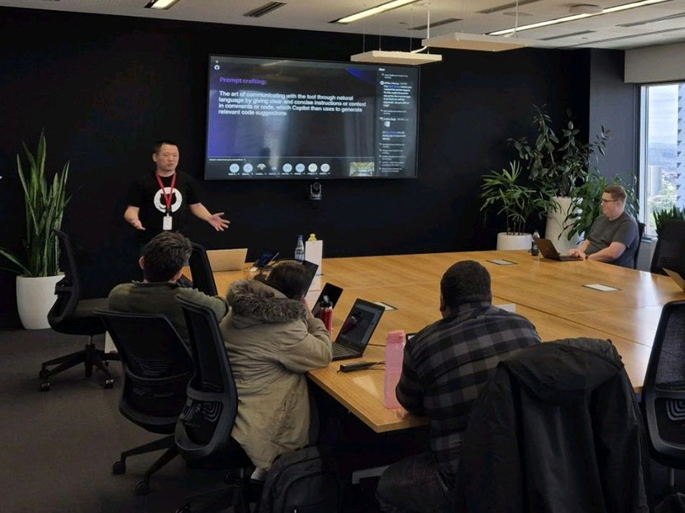
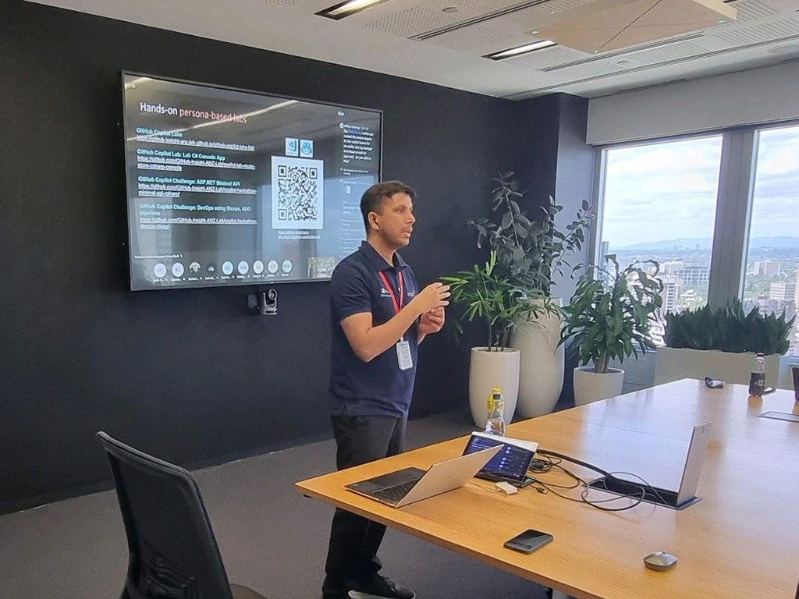
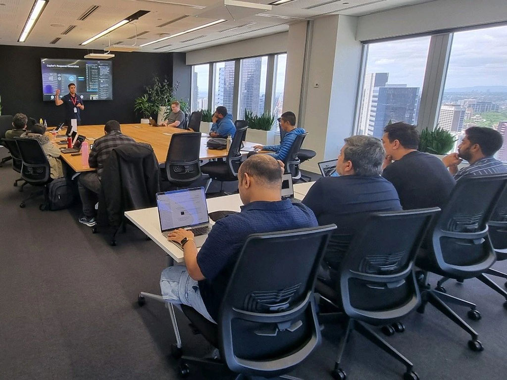
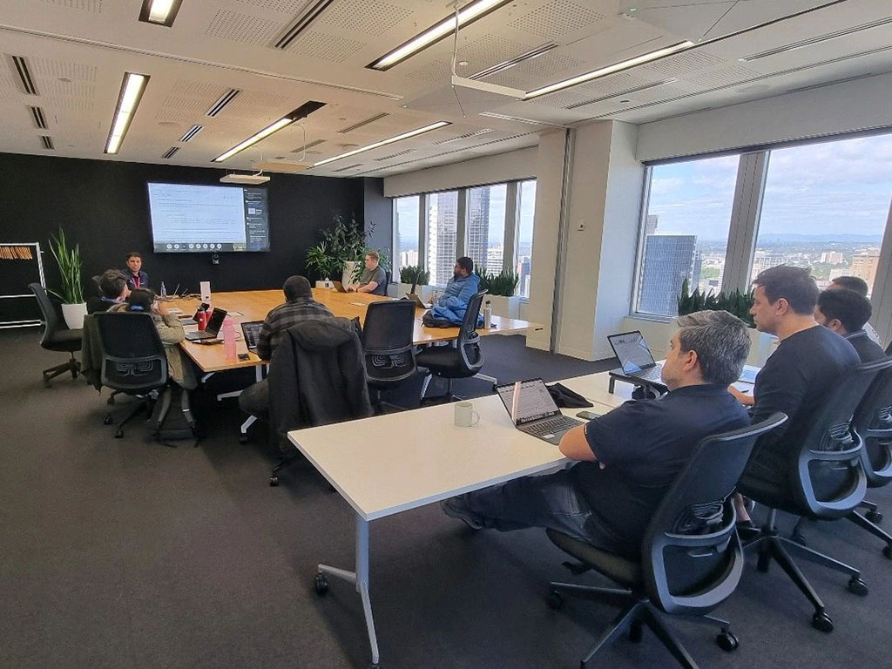
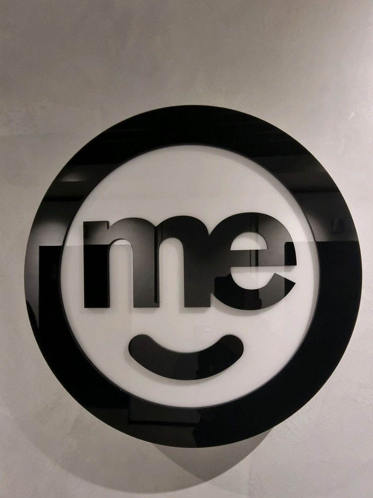

'Grab a GitHub T-shirt 👕 before they're all gone!' At ME Bank, this has turned out to be my favorite opening line for our GitHub Copilot excitement day!

My amazing Insight teammate, Rakesh, and I had the pleasure of hosting another engaging session with the ME Bank / BOQ Group in Melbourne. 🌟 Fantastic job, Rakesh and Ahmed, on successfully running three sessions this week!

The enthusiasm in the room was fantastic! Everyone was eager to explore what Copilot can bring to our day-to-day workflows. From automating repetitive coding tasks to boosting productivity, the possibilities are truly exciting!

Thank you to all the participants for your curiosity and energy, especially Thien. We can't wait to see how you leverage Copilot in your projects! 💻✨

Now, time to catch my third flight of the day and head home! 🛫

  

    
  

  

    
  

  

    
  

  

    
  

  

    
  

<a href="https://www.linkedin.com/posts/qkfang_copilot-activity-7258012079704408064-OCvN" target="_blank">Read more via LinkedIn Post</a>
