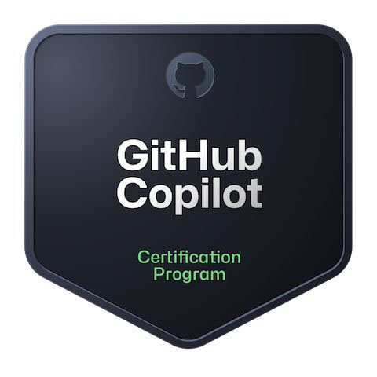
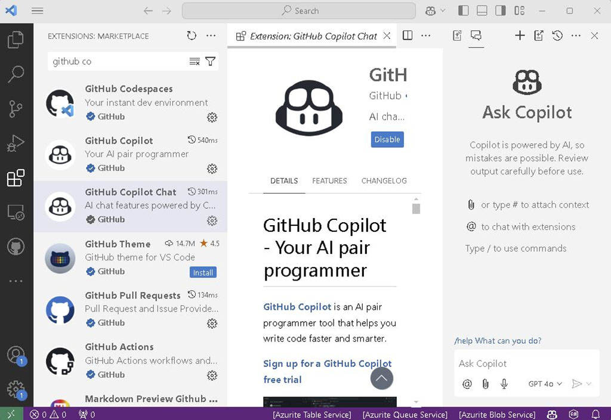

Badge unlocked: hashtag#GitHub hashtag#Copilot Certification secured! 😎 Let's code smarter, not harder! 💻 

This isn't just another shiny badge - it's proof of the skills in wielding AI-driven code completion like a pro. From streamlining boilerplate code to cracking complex algorithms, hashtag#GitHubCopilot has been my best sidekick, and now it's official: I know how to make it work its magic! More about certification here : https://resources.github.com/learn/certifications/

And guess what? GPT-4o just appeared in the latest extension update in VS Code, with previews of Claude 3.5, o1, and o1-Mini. The AI ecosystem just keeps getting cooler, and I'm in for it! 💻✨

Want to learn more about the certification? Check it out my post: https://blog.insight-services-apac.dev/2024/10/09/github-copilot-cert

AI + Code = The ultimate power couple.🔥 Let's keep riding this wave!

  

    
  

  

    
  

  

    
  

<a href="https://www.linkedin.com/posts/qkfang_github-copilot-githubcopilot-activity-7260624040908718080-4l6V" target="_blank">Read more via LinkedIn Post</a>

