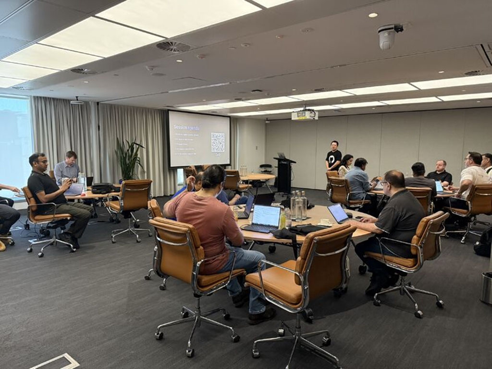

On a scorching Sydney day, we turned up the excitement even more with our GitHub Copilot Excitement Day! 🎉 The room at Perpetual Limited was packed with energy as developers, data engineers, and DevOps teams came together to explore how GitHub Copilot is shaking up the way we work.

We led a hands-on session demonstrating how Copilot can streamline coding and enhance efficiency. The day sparked vibrant discussions on fostering creativity and collaboration across teams. We also shared real-life examples of how Copilot is already helping us tackle challenges and achieve impactful results. 🚀

A massive shoutout to everyone who made the day unforgettable, especially Jan and Ross for organizing the session! Great to see Insight teammate Alpesh and Praveen in the room too!

