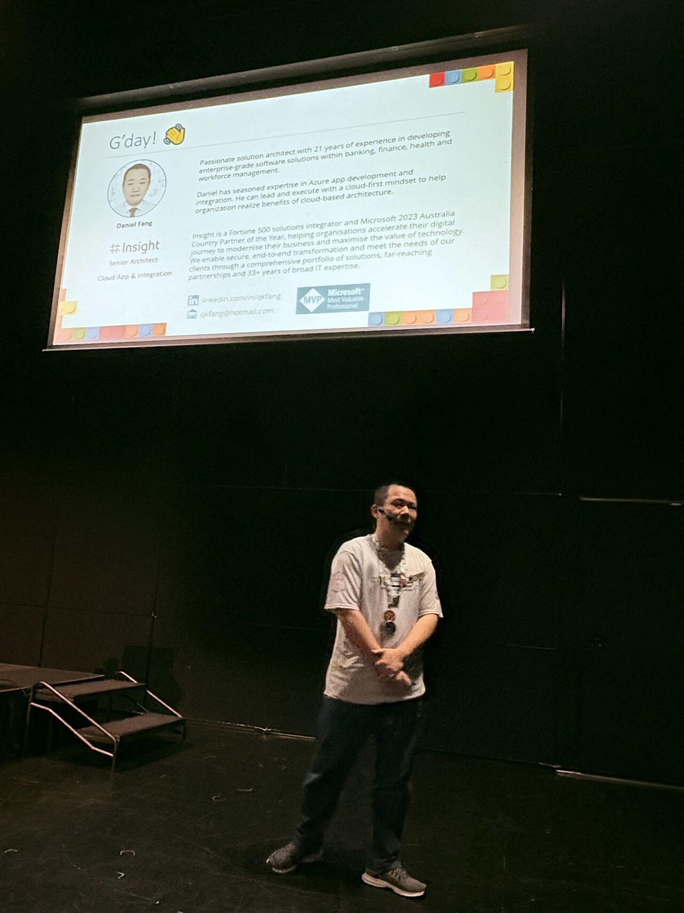
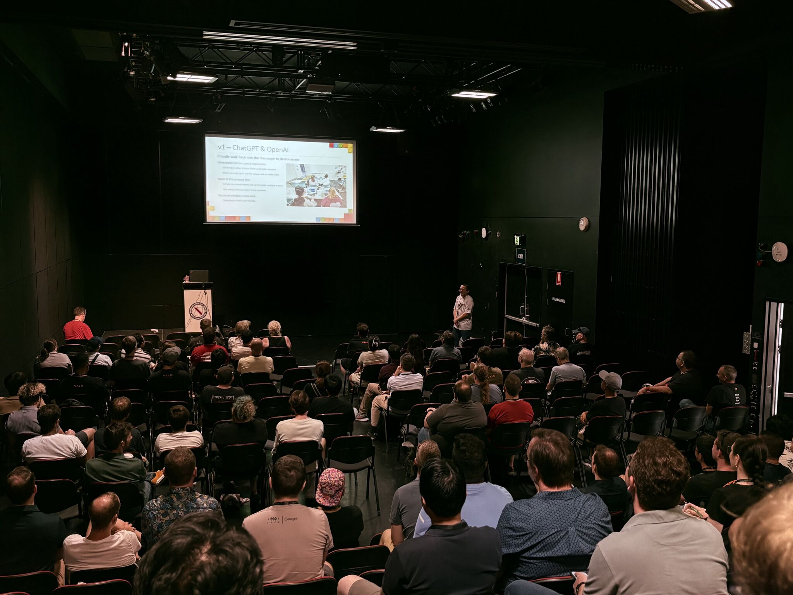
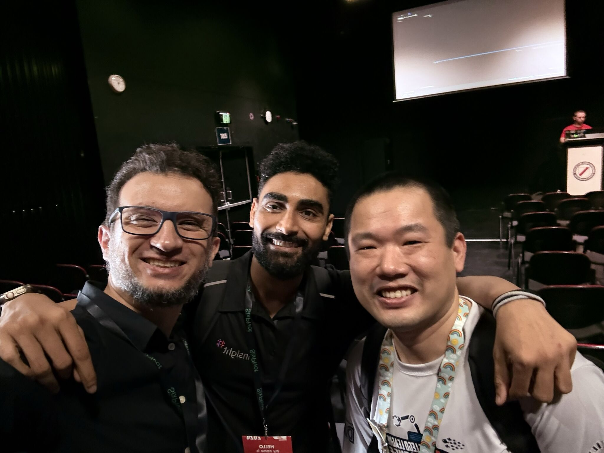
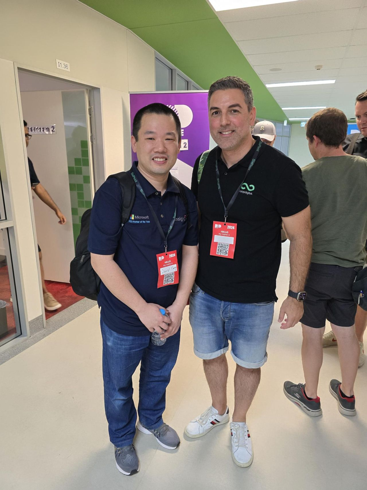

4am wakeup and 7am flight - totally worth it for an wonderful day at DDD Brisbane last Saturday! I'm so flattered and grateful that so many people joined me for my talk about LEGO AI and FLL. 

Thank you for agreeing that I earned the cape in the end! 🦸‍♂️ Appreciate the interest and great chats afterward, Andrei and Gerald.

 
The only downside? Wishing I could clone myself to attend every talk! Huge shoutout to Joel (I did not tag you on social), Michelle (it is not luck but hard work from the girls!), Jason (C# & .Net will always be my favorite), Bryden & Luke (cool hats & photos!), Julian (I wrote RSA at uni as assignments) for your insightful talks - I walked away with new ideas and inspiration!

 
And of course, it was so lovely to catch up with new & old friends like Fabrizio, and Insight teammates. DDD events are as much about the community as they are about the content. To top it all off, look what I found at the airport on my way back to Sydney: a life-sized LEGO Captain! (last photo)

 
Thanks again, DDD Brisbane (especially Chris & Bronwen), for such a rewarding and enriching experience.

Will DDD Sydney come back one day? I will definitely sign up for volunteering!

