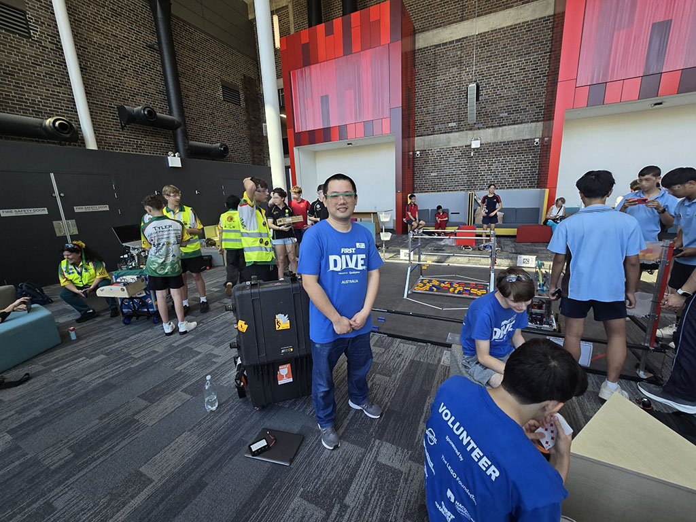
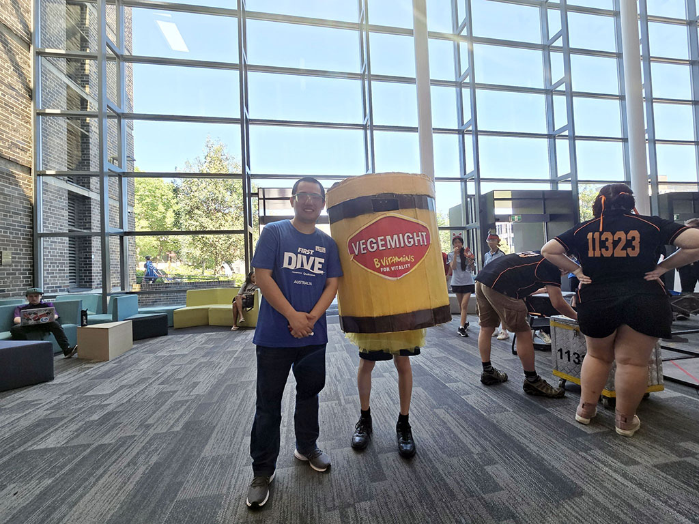
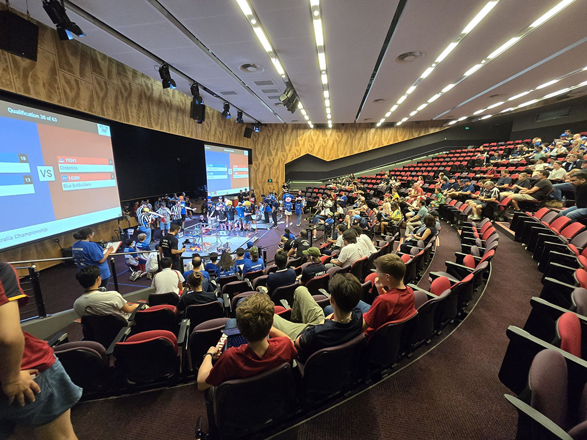
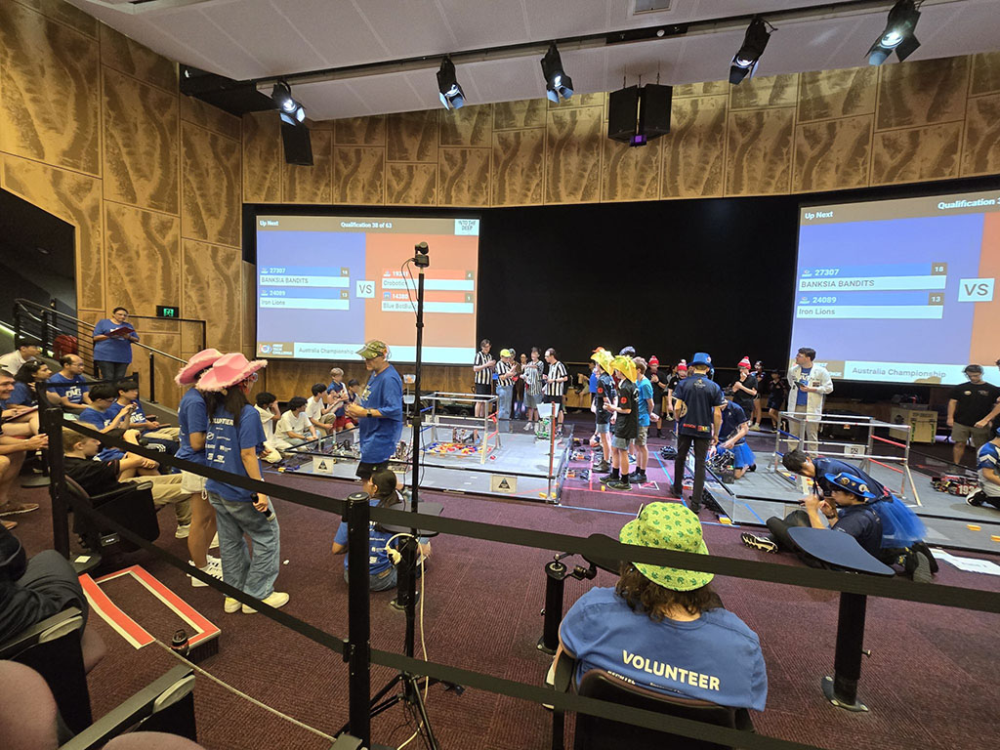
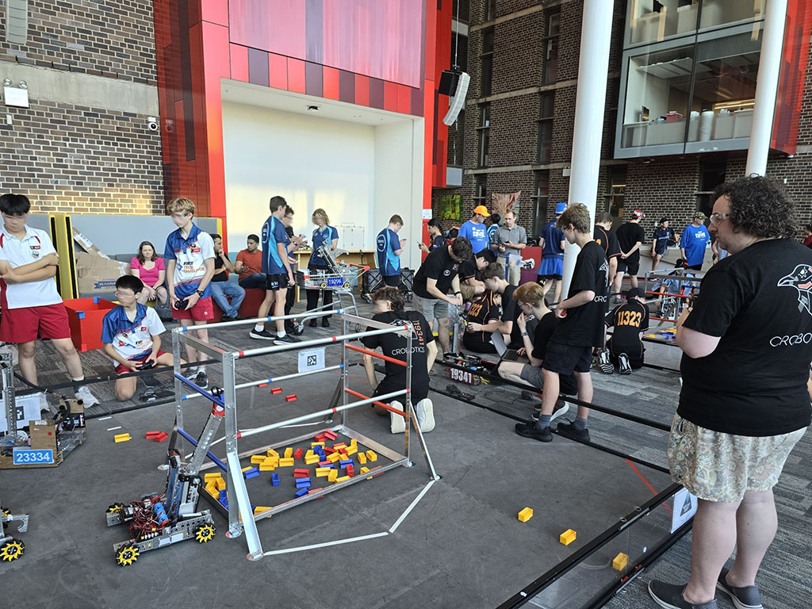
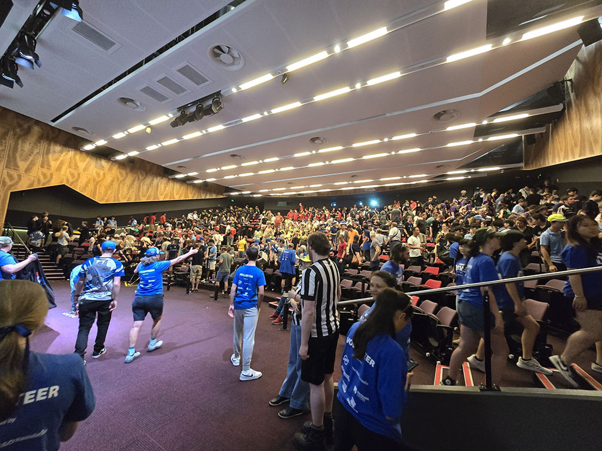

No longer qualified as an 'engineer' after my first FTC , guess I'll have to stick with 'Software Engineer' from now on. 😅

  

    
  

  

    
  

Volunteering at the FTC Nationals today Macquarie University was both inspiring and humbling. I walked in feeling confident in my skills and walked out realizing the FTC teams operate on an entirely different level. 🧠💻

  

    
  

  

    
  

My job today? Keeping the two practice fields in order. 🏟️ And hey, looks like I did an okay job at that! ✅ Meanwhile, the FTC teams were out there pushing the boundaries of what I thought was possible. Watching them work was like seeing a masterclass in precision, creativity, and pure technical brilliance. 

A huge congratulations to the winning teams! 🏆 And a big shoutout to all the volunteers who made the day run smoothly - it's not just a competition; it's a community effort. Special kudos to Will & Daniela for their amazing work! 👏

  

    
  

  

    
  

