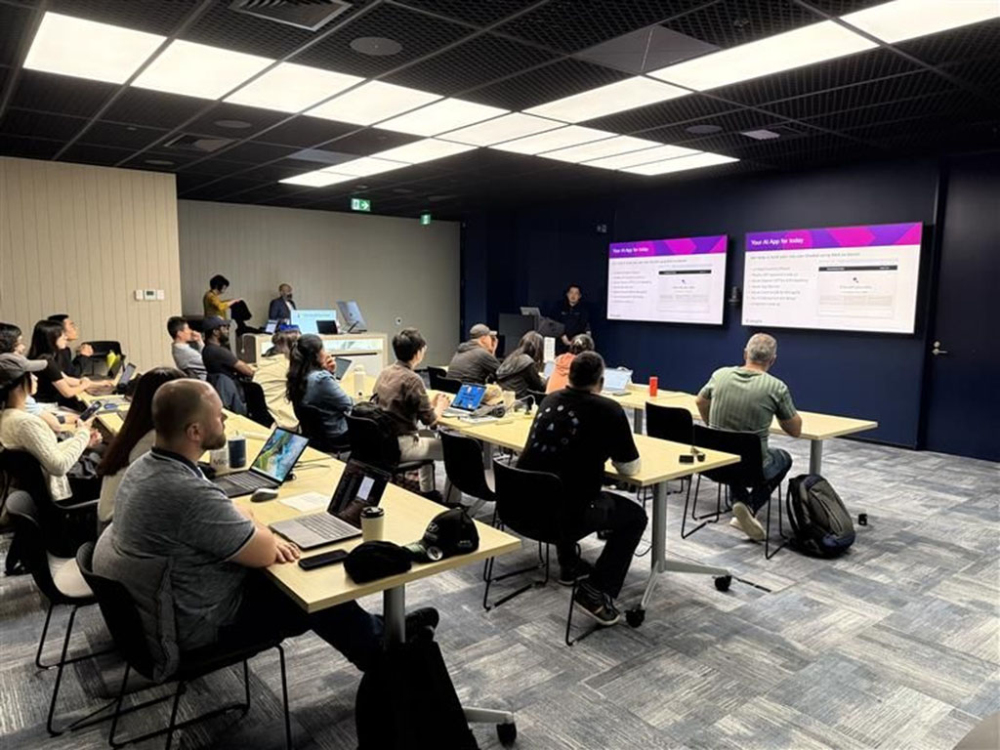
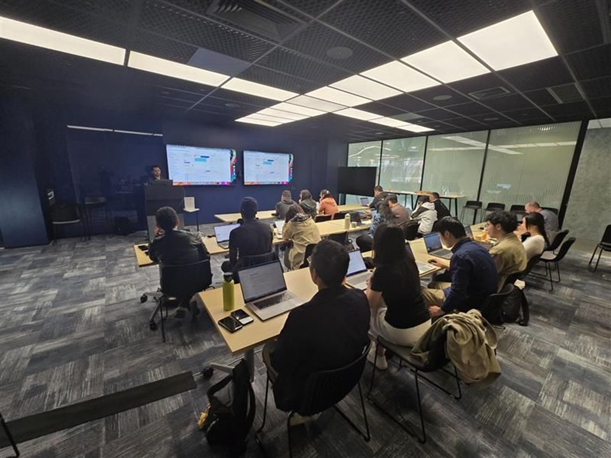
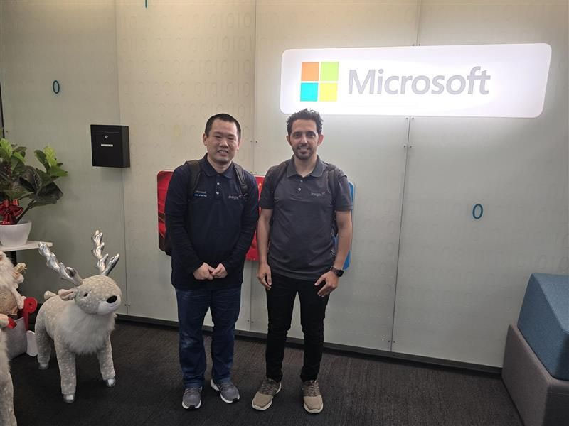
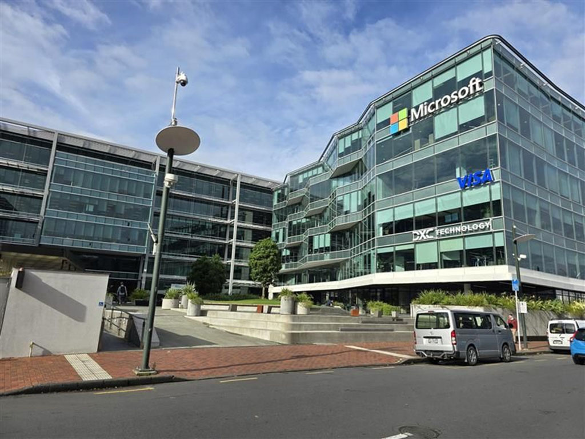

Innovation overload in Auckland! 🚀 Just rounded off another unforgettable AIAppinOneDay workshop in Microsoft office with Ahmed, and it was all about getting our hands dirty with Azure AI services. 

Yep, we built a RAG chatbot from scratch 💬 - embedding generations, vector searches, LangChain orchestration. It was like taking OpenAI models to the next level, with a vibe that screamed: "Let's build cool stuff!" 
 

  

    
  

  

    
  

The best bit?💡Realizing we can make AI apps for literally anything. Work? Sorted. Fun? Oh yeah. What about an app to predict the next lottery numbers (an idea from crowd) ! Are we coding or dreaming? Who cares - it's genius.
 
Shoutout to everyone in the room who brought the energy, ideas, and what if moments. 🤝 

  

    
  

  

    
  

<a href="https://www.linkedin.com/posts/qkfang_auckland-aiappinoneday-azure-activity-7272103184116936704-HzqH" target="_blank">Read more via LinkedIn Post</a>
