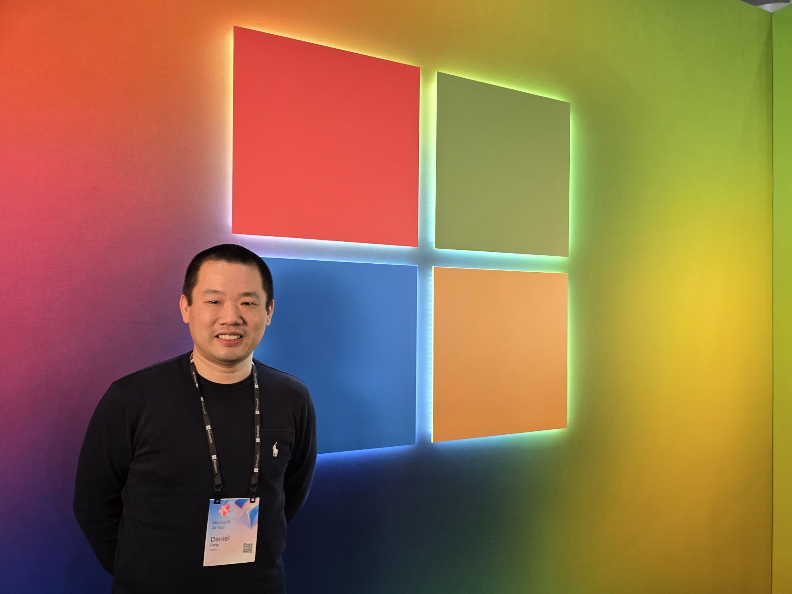
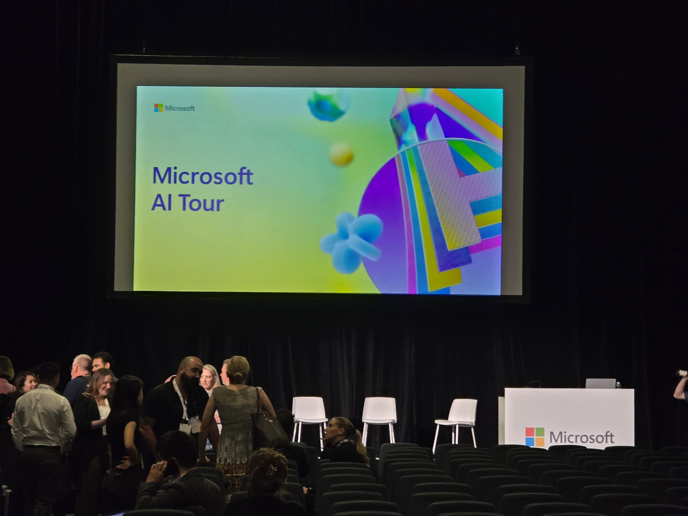
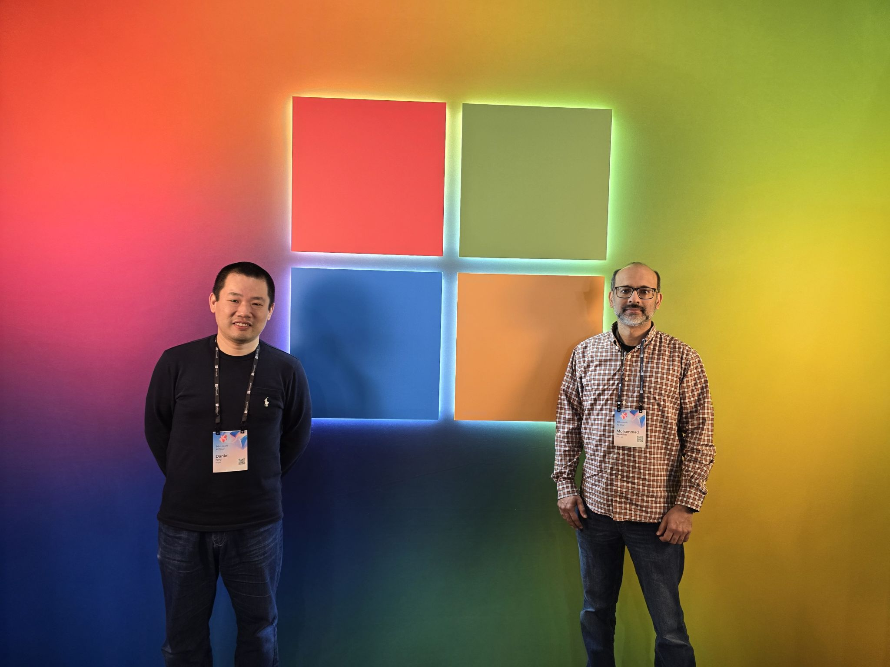
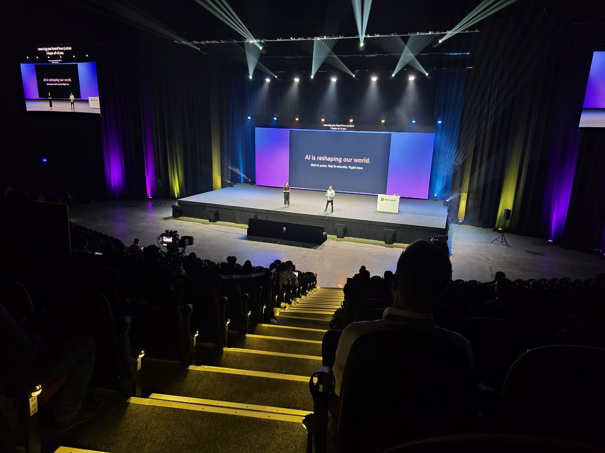

Fun day at the Microsoft AI Tour @ Sydney! Lucky I made it back from Auckland ✈️ just in time to be one of the 6000+ participants! 

I absolutely loved the keynotes, workshops, breakouts, and interactive sessions! Each one packed with valuable insights and inspiration. And let's not forget the Microsoft photo booths, such a fun and creative way to capture the day with friends like Saadullah! 📸

Especially thrilled to see PetAI being showcased in multiple occasions. Such a proud moment for our Insight team! 

From cutting-edge Azure AI tools to real-world success stories, the event showcased the power of AI to drive transformation and innovation. Plus, the chance to connect with industry peers and experts was the cherry on top. 🍒
