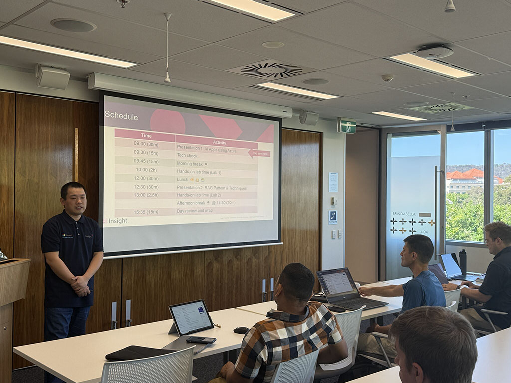
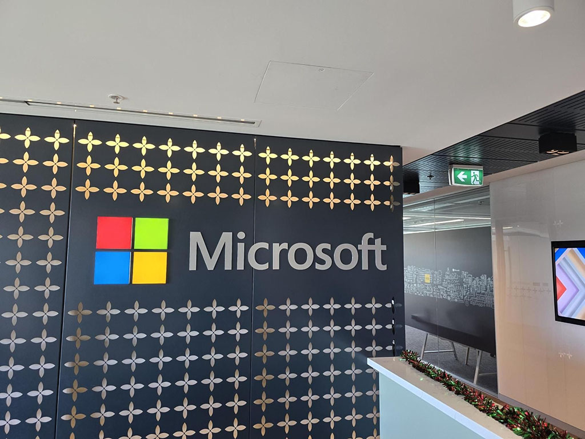

One last AIAppInOneDay workshop in 2024 at the Microsoft Canberra office to wrap up the year! On what turned out to be a record-hot day🔥, the energy in the room was even hotter (and no, it wasn't just because one of the A/C units went down in the morning 😅). 

We dove into building AI apps using Azure AI Services, and the excitement was contagious! 🎉 We discussed questions on topics like evaluating LLM responses using AIFoundry and dove into experiments with GraphRAG from Microsoft Research.

The session was filled with insightful questions, innovative ideas, and collaborative problem-solving ✨, highlighting the transformative power of AI in reshaping how we think and develop.

A huge shoutout to all the participants for your curiosity and engagement that made this workshop a remarkable success! 🙌 We did it again, Ahmed Youssef! 💡 Special thanks to Tracey, Michelle, and Ross for organizing this fantastic workshop!

  

    
  

  

    
  

