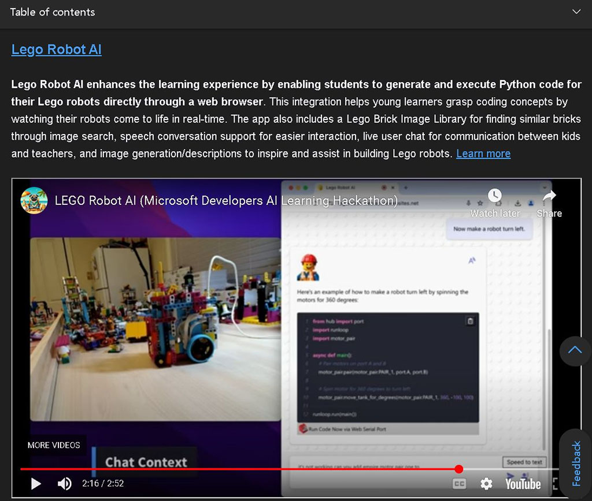
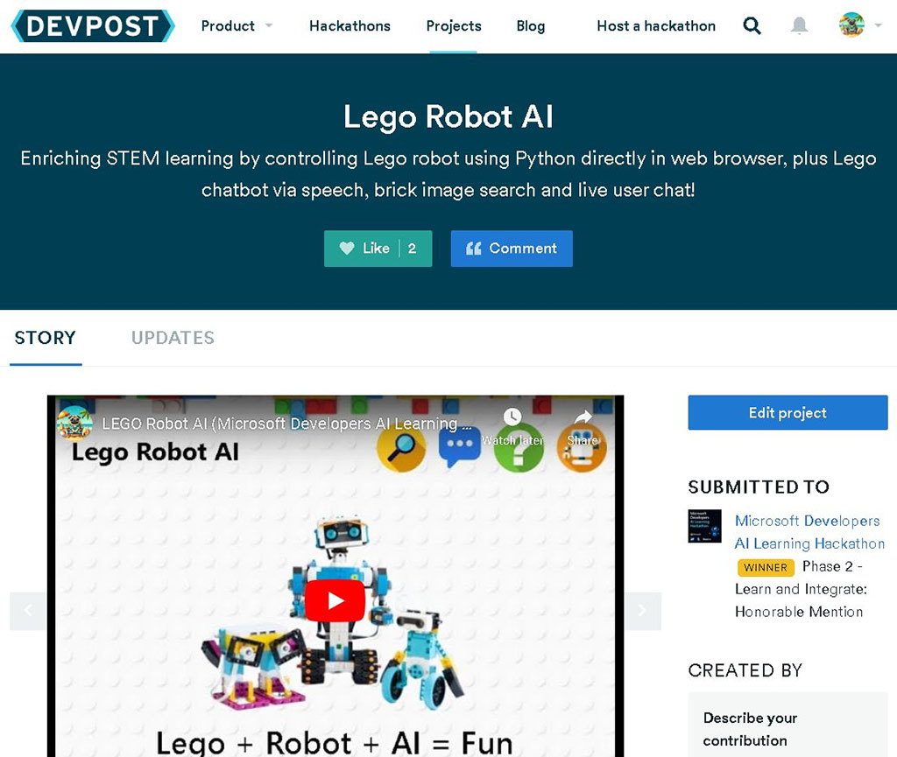

Lucky! 🍀 My hashtag#AzureAI and hashtag#CosmosDB hackathon project was a winner (honorable mentions) and featured on the Microsoft hashtag#Azure Cosmos DB Dev Blogs last October (just noticed it) ! A few weekends of hard work truly paid off! ✨

This AI hackathon had over 9,500 developers world-wide engaged with Azure Cosmos DB and Azure AI services, making it one of the most popular on Devpost, ranking in the top 0.2% of all Devpost hackathons. 🔥 

📢 Checkout my "LEGO Robot AI" and other winner's projects in this blog: "Meet the Winners | Microsoft Developers Azure AI & Azure Cosmos DB Learning Hackathon": https://devblogs.microsoft.com/cosmosdb/meet-the-winners-microsoft-developers-azure-ai-azure-cosmos-db-learning-hackathon/#lego-robot-ai

💖 A huge shoutout to Ricky, Lanna, Jasmine, Reddy, Marko, Aveneel, João, Microsoft hashtag#CosmosDB team and Devpost for hosting this incredible hackathon last year. Excited to keep building and innovating with Azure AI and Cosmos DB! 🚀

  

    
  

  

    
  

  

    
  

<a href="https://www.linkedin.com/posts/qkfang_azureai-cosmosdb-azure-activity-7282695334290464768-i1Nb" target="_blank">Read more via LinkedIn Post</a>
