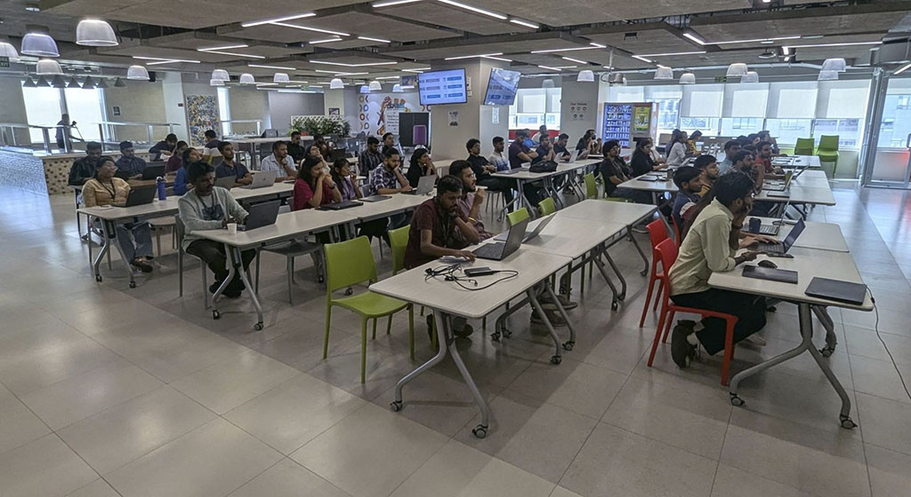
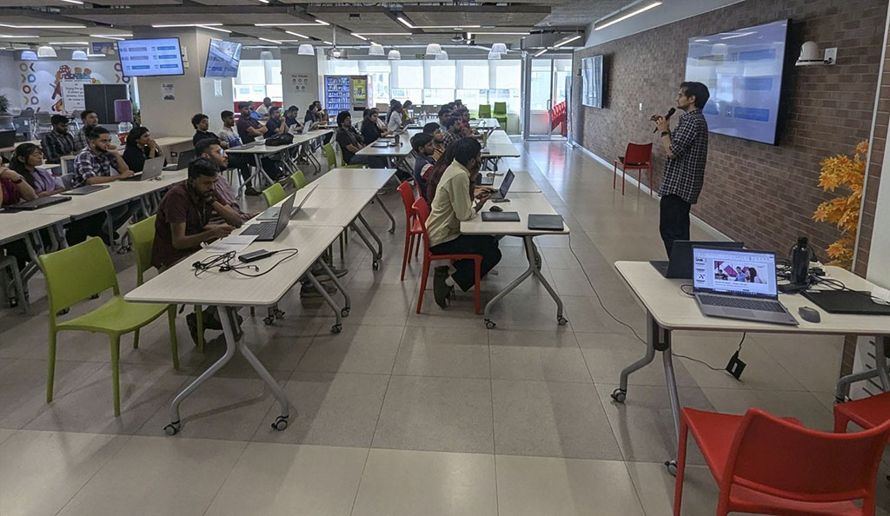
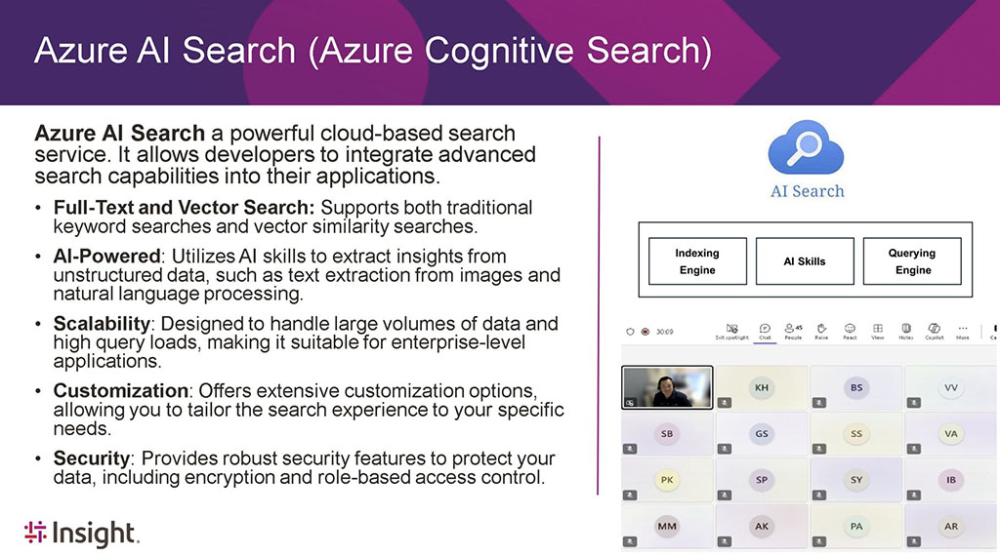

AI Innovation in Action at Anko Idea Forge's Epic Hackathon Sessions! 🚀Insight Cloud App team is honored to host three engaging sessions with Anko GCC, taking dev team on an action-packed journey into AI development! Together, we explored the power of AzureAI and GitHub Copilot, equipping innovators with the tools to build the next generation of AI-driven applications on Azure.

🔥 Primer Session 1: AI Apps on Azure by Ahmed
We kicked things off with a deep dive into Azure's powerful AI ecosystem, exploring how to build GenAI applications. From prompt engineering exercises to demos, participants got their first taste of AI-driven innovation.

⚡ Primer Session 2: Azure AI services & GitHub Copilot by Daniel
Taking things to the next level, we explored a number of AzureAI services and LLM techniques like RAG and saw firsthand how GitHub Copilot can supercharge coding - boosting speed, efficiency, and creativity.

🏆 Hackathon & Challenges by Ajay
2-hour live demo on building an AIApp, followed by real-world problem statements featuring six GenAI challenges designed specifically for Anko. Participants will take these challenges home and apply their skills to tackle these AI use cases and drive innovation.

🔜 What's Next: Feedback & Demo
Winners will be crowned, 💡solutions will be showcased next week, and we'll witness firsthand how AI is making a real-world impact. With over 60+ super keen participants, the competition is fierce!

This is just the beginning! AI is revolutionizing app development, and with Azure AI & GitHub Copilot, the future of innovation is in our hands. 🤖⚡

  

    
  

  

    
  

  

    
  

<a href="https://www.linkedin.com/posts/qkfang_azureai-github-copilot-activity-7290695221107904512-ipa1" target="_blank">Read more via LinkedIn Post</a>
