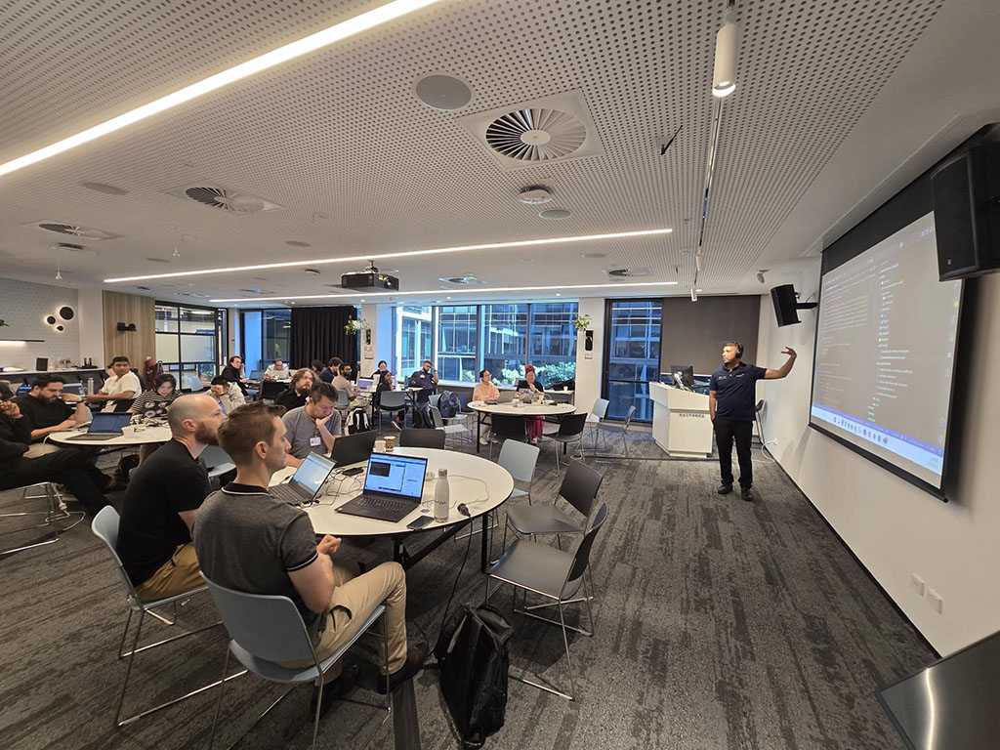
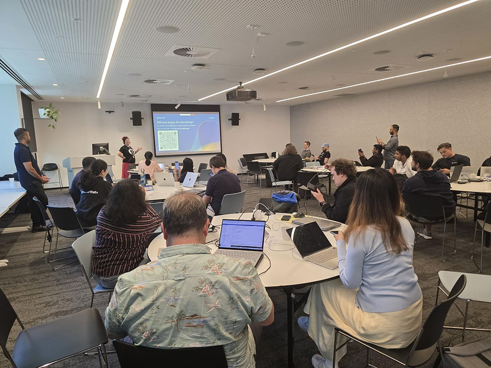
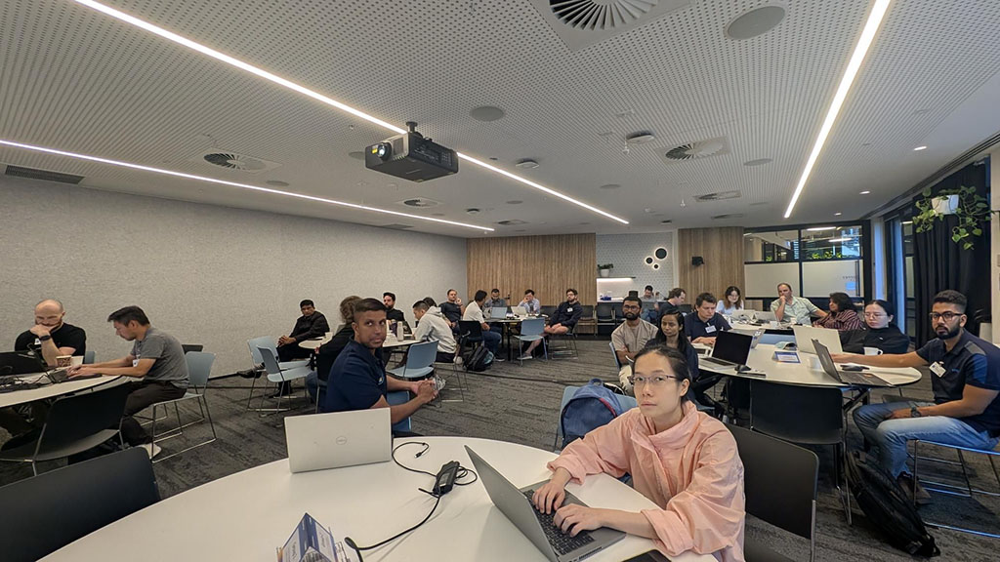
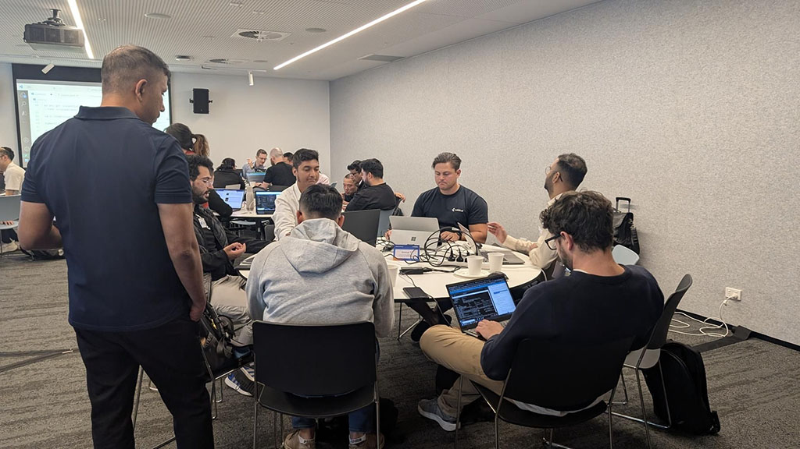
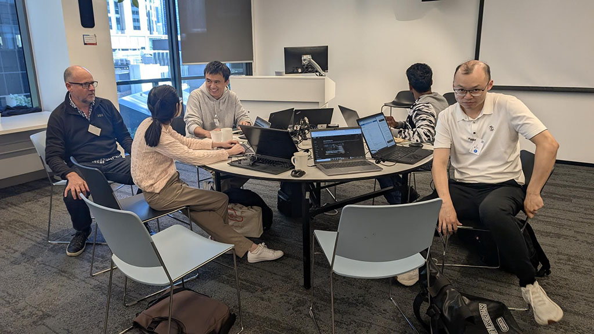
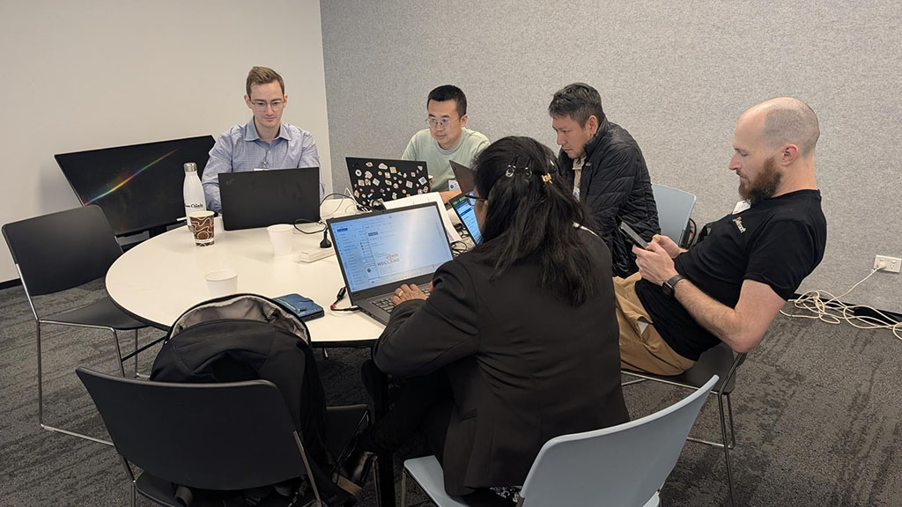
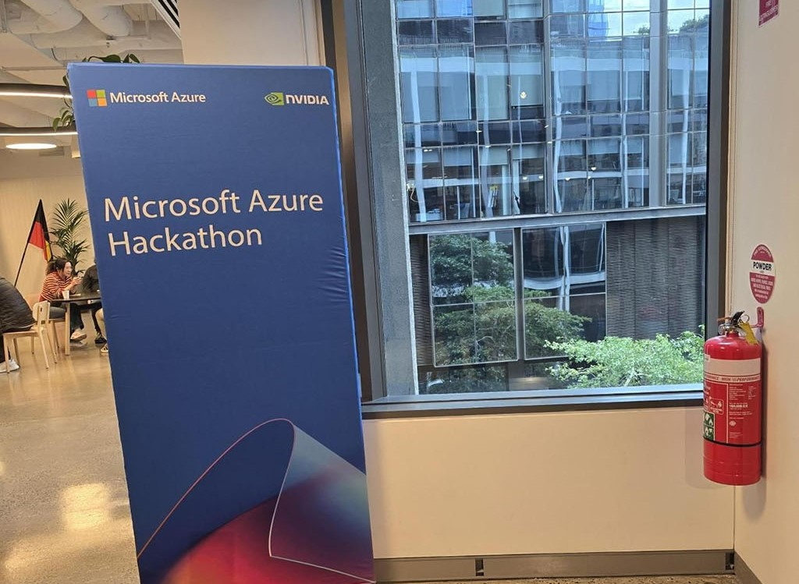
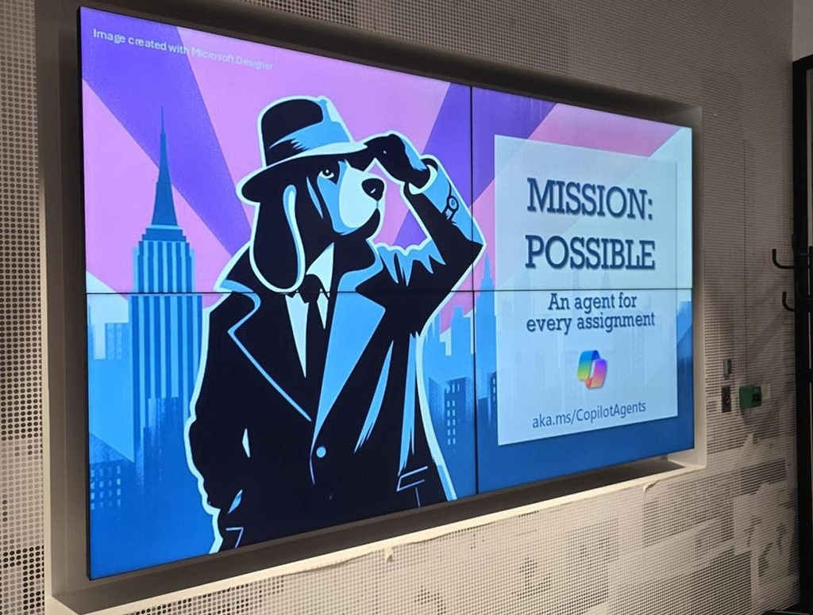

Intelligent App Development with CopilotStack Hackathon – Mission Accomplished! 🚀 
Non-stop two-day hackathon at the Microsoft Melbourne office, showcasing accelerated computing from NVIDIA on Azure ! 💡💻 

💡 Key Tech Explored 💡
🔹 Copilot Stack architecture and components
🔹 Azure AI Foundry & various AI services (Content Safety, Speech, Vision)
🔹 Azure AI Search, Azure Open AI Service, Agent Service
🔹 NVIDIA NIM on AKS
🔹 NVIDIA Triton Inference Server on Azure ML
🔹 NVIDIA DGX Cloud & NGC
🔹 NVIDIA NeMo & CUDA
🔹 NVIDIA A100 GPU on Azure
🔹 Semantic Kernel & Prompty
🔹 AI App Dev Tool Chains

🙌 Can't wait for the next one! 

  

    
  

  

    
  

  

    
  

  

    
  

  

    
  

  

    
  

  

    
  

  

    
  

  

    
  

<a href="https://www.linkedin.com/posts/qkfang_copilotstack-hackathon-azure-activity-7300148262538199040-NMWH" target="_blank">Read more via LinkedIn Post</a>
