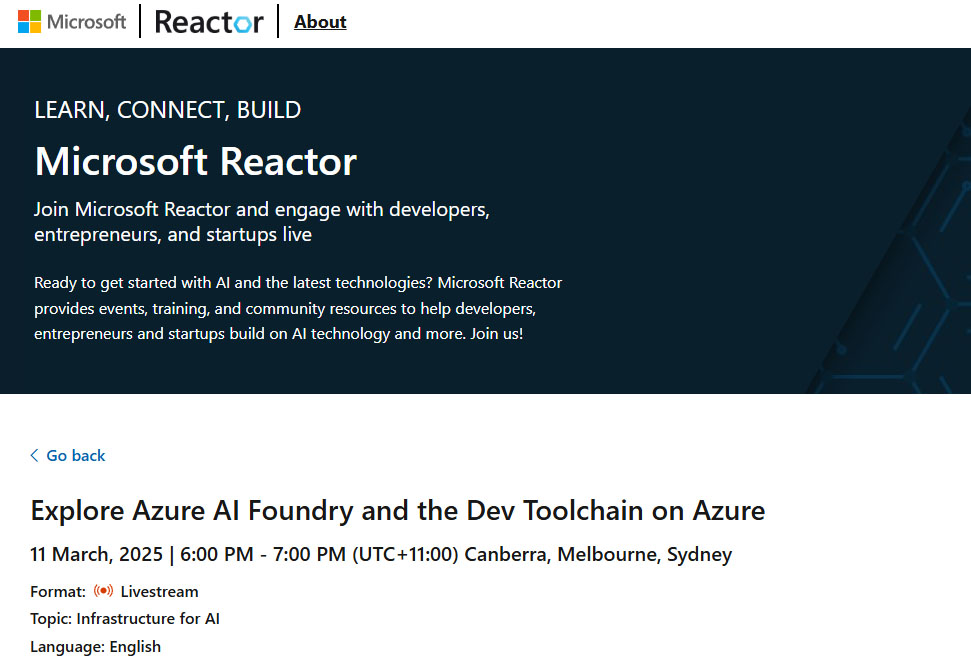
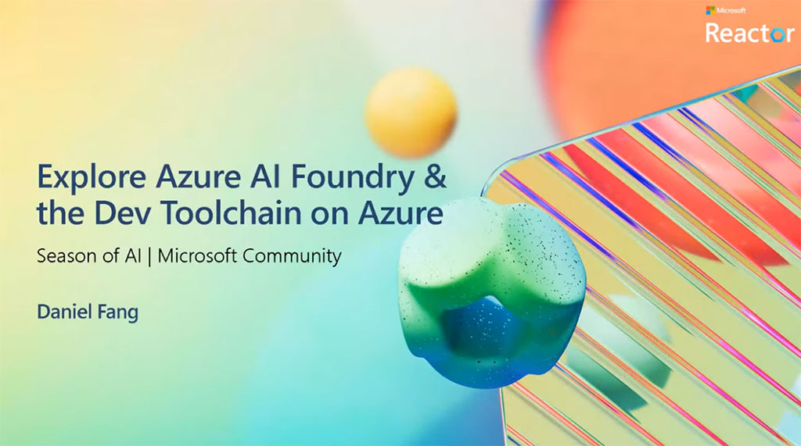
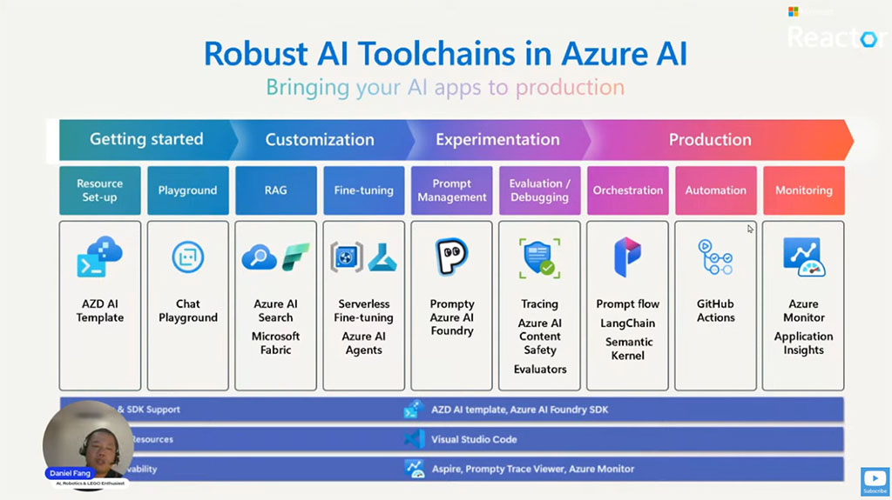

Unlock the power of GenAI and accelerate AI apps from development to production using familiar tools. This session explores how Azure AI Foundry and related dev toolchain streamline the development and operationalization of AI apps.

You'll be guided through AI app development lifecycle (from ideation to production) covering key techniques in prompt engineering, coding, evaluation, monitoring, and deployment. Discover how tools like Azure AI Foundry, AZD CLI, AI Toolkit for VS Code, and Prompty enable seamless development, deployment and management.

Whether you're a developer, AI engineer, or IT leader, you'll gain practical knowledge to build and scale AI applications efficiently. Get ready to build your AI projects with ease on Azure!

  

    
  

  

    
  

  

    
  

<iframe width="560" height="315" src="https://www.youtube.com/embed/4w7g59ZRtfw?si=LSOXlYLQdvexw7-8" title="YouTube video player" frameborder="0" allow="accelerometer; autoplay; clipboard-write; encrypted-media; gyroscope; picture-in-picture; web-share" referrerpolicy="strict-origin-when-cross-origin" allowfullscreen></iframe>
