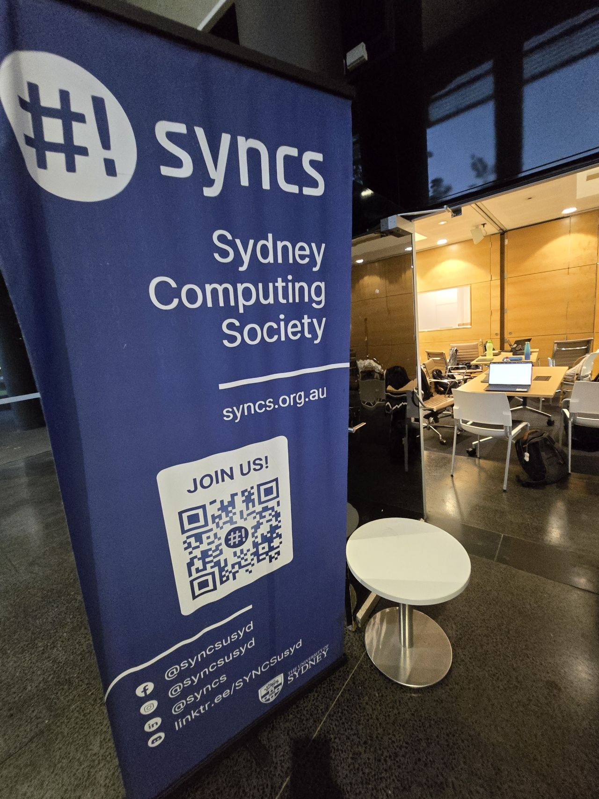
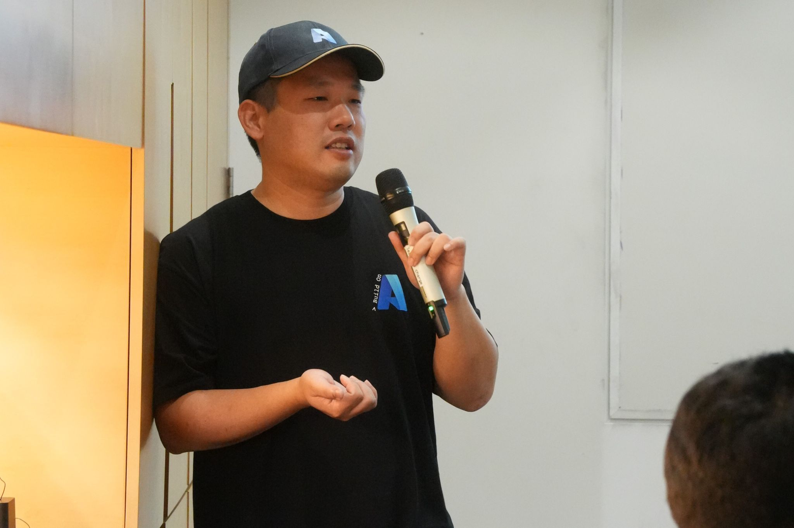
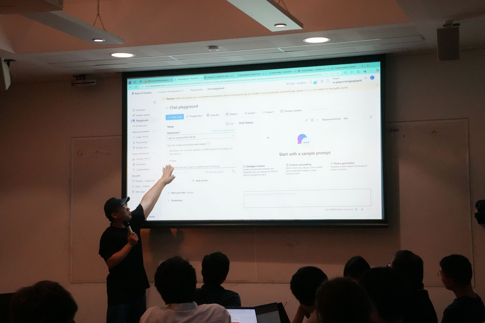
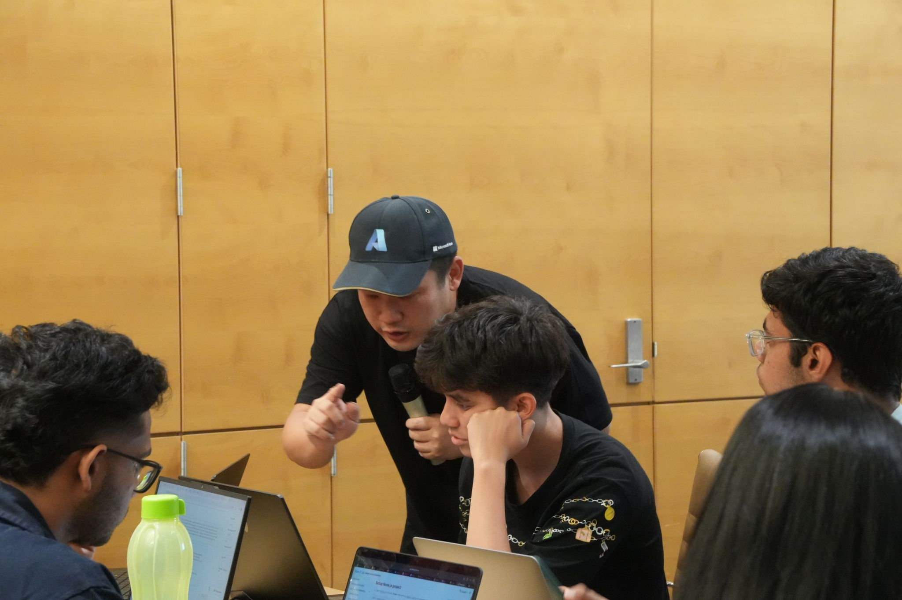

🚀 Kicking off AI Journeys with hashtag#SYNCS at University of Sydney! 🎓✨ What an incredible night with 60+ keen students from the Sydney Computing Society (hashtag#SYNCS) joining me for the 'Kickstart Your AI Journey on Azure' workshop! 💡💻

The energy in the room was amazing 🔥, the entire boardroom was packed, and I couldn't be more impressed by the enthusiasm and curiosity of everyone who attended. 🙌

Huge shoutout to Rawan, Robin, Cohen, and SYNCS's marketing and events team for your dedication in organizing and planning this for the past six months 👏, so glad we made the first session happen, and excited for round two in April! 🎉 Join SYNCS here: https://syncs.org.au/

And yes, rocking my hashtag#Azure cap and t-shirt, I totally blended in and felt 20 years old again 😆. Looking forward to seeing how everyone shapes the future of hashtag#AI! The pizza was delicious! 🍕

https://www.linkedin.com/posts/qkfang_syncs-syncs-azure-activity-7306270853120372736-SxUF?utm_source=share&utm_medium=member_desktop&rcm=ACoAAASgfsoBmYiw8tp4obmNica7vrvpxPRDwCY

