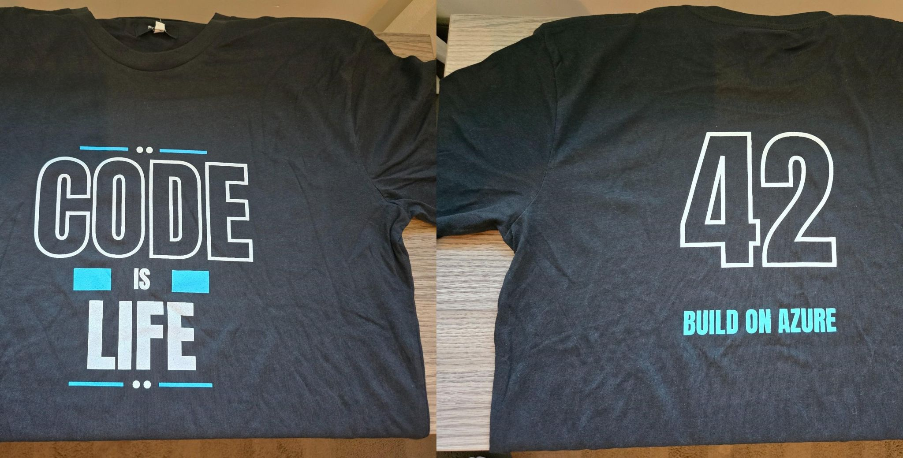
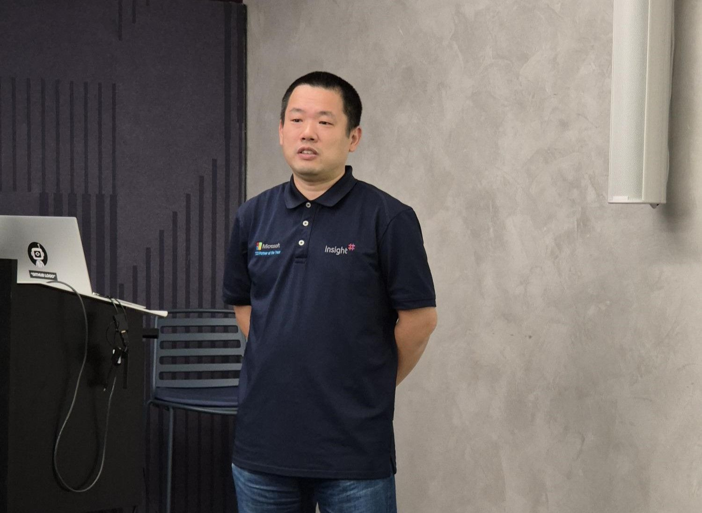
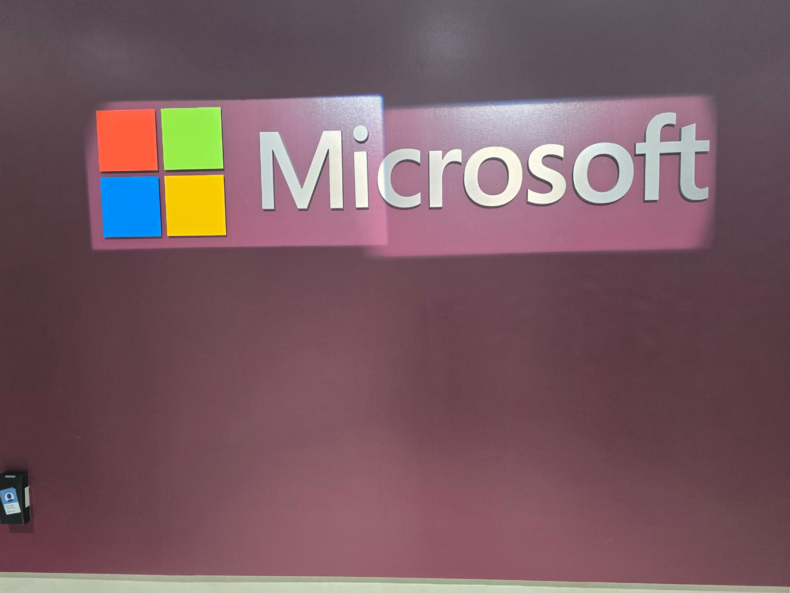
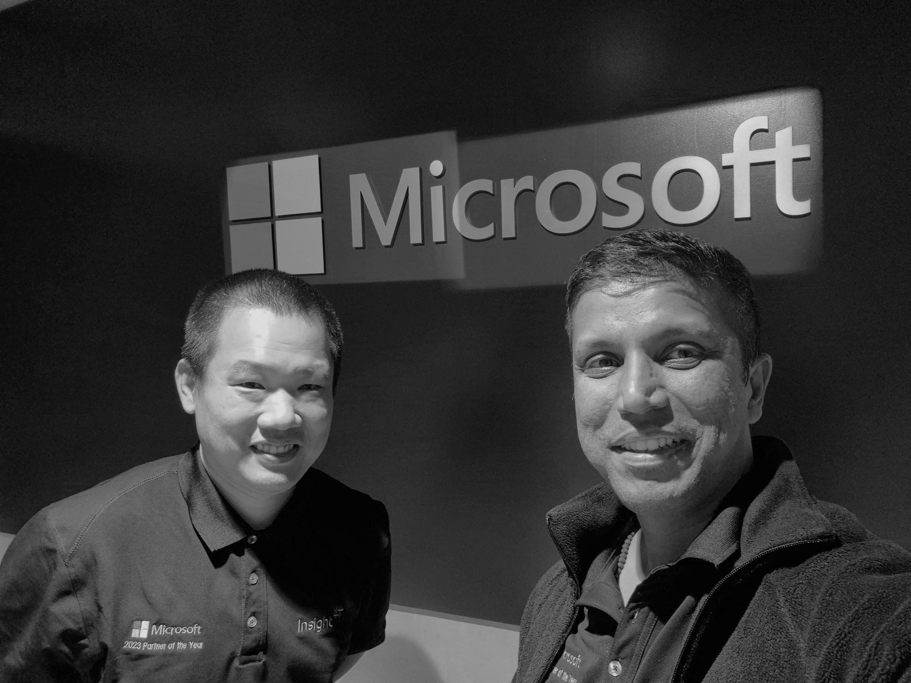

🚀 AI App in a Day is back in Wellington! 🌿 During today's session, Rakesh and I explored hashtag#AzureAI services, hashtag#ContentSafety, hashtag#AISearch, hashtag#CosmosDB, LangChain, and various techniques to enhance hashtag#LLM responses, ensuring more accurate, efficient, and context-aware AI solutions. 🚀🔍

This time, we added a Jupyter Notebook for Graph RAG (from Microsoft Research) as new lab exercise, and it was amazing to see one of the participants had already implemented hashtag#GraphRAG in a past project! 🔥 Seeing real-world applications of AI in action is always inspiring.

Of course, no event is complete without tasty food and awesome swag! 🍕👕 Speaking of hashtag#swag… quick question: does anyone know what number 42 stands for in the "Build on Azure - Code is Life" T-shirt? 🤔 (3rd photo) We could not figure it out !

A huge thank you to everyone who joined us, it was an incredible day, especially with that stunning afternoon weather! ☀️ Appreciate your help, support and organizing Kotomi, Michelle & Ross !

Keep building, keep innovating on hashtag#Azure ! 💡✨

https://www.linkedin.com/posts/qkfang_azureai-contentsafety-aisearch-activity-7307628362770890752-9QZo?utm_source=share&utm_medium=member_desktop&rcm=ACoAAASgfsoBmYiw8tp4obmNica7vrvpxPRDwCY

