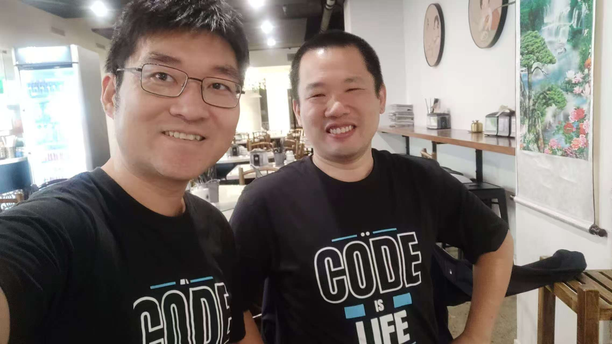

Had the pleasure of meeting Microsoft MVP Xiaodi Yan here in Wellington — what an inspiring and insightful catch-up!

Huge thanks for the delicious food and even bigger congratulations on your recently published book, Web API Development with ASP.NET Core 8! 🎉📚

Incredible to hear it's now part of the Microsoft Redmond campus library — a truly well-deserved recognition!

Always energizing to connect with folks who are passionate about tech and generous in sharing their knowledge. Looking forward to more conversations ahead!

  

    
  

  

     
  

  

    
  

