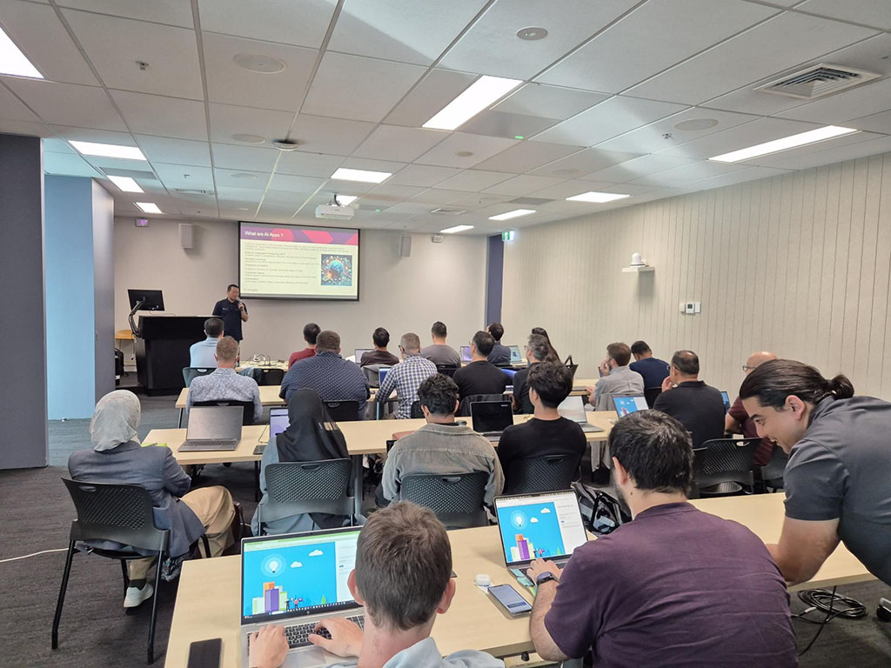
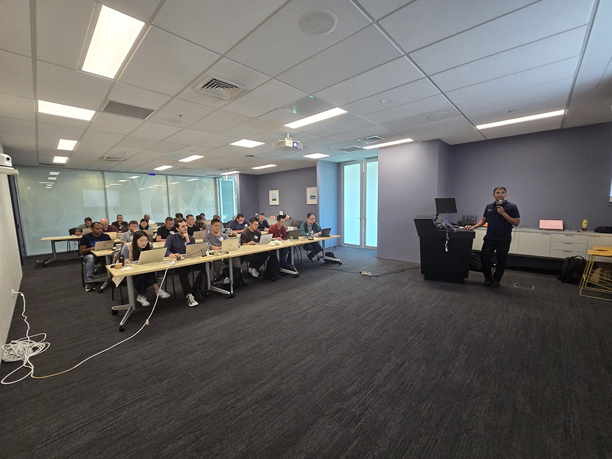
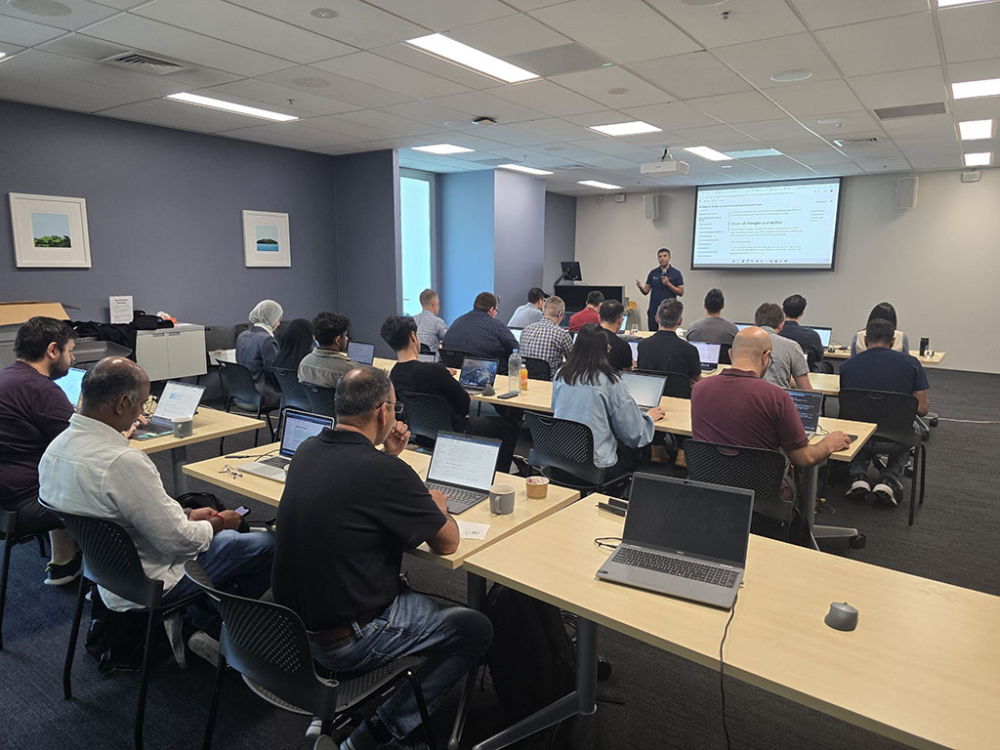
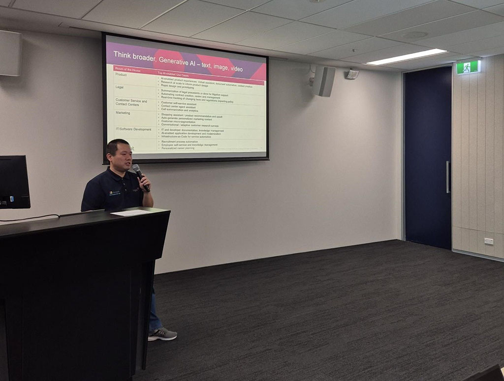
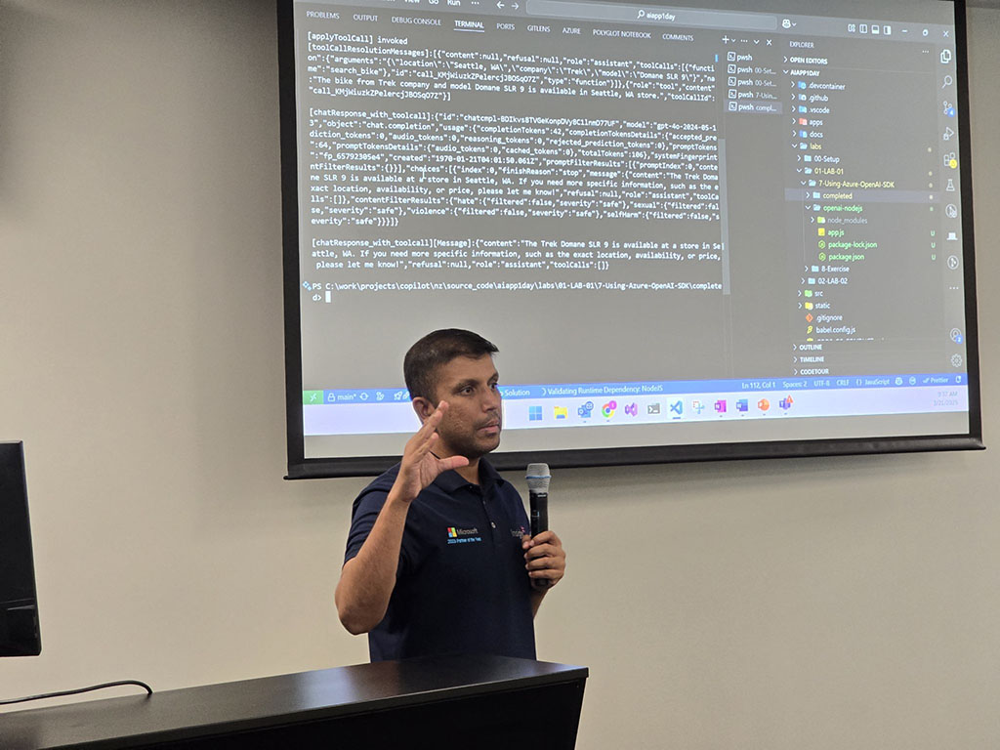
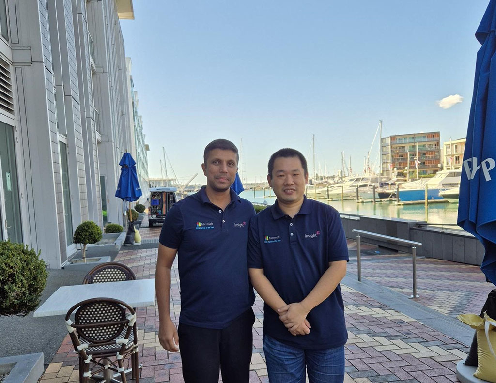

☀️ Beautiful weather and brilliant minds! Awesome time at AI App in a Day session at the Microsoft Auckland office! The sun was shining, the room was buzzing with energy, and we had a full house of curious participants ready to dive into AI app development on Microsoft Azure .

From setting up GitHub Codespaces, running the chatbot with RAG in action, and completing all three labs (even with 5 minutes to spare!) - It was one smooth ride. 🧠💻

As always, we tossed in a few brain teasers throughout the session to keep the energy and creativity levels high. You know it's been a brain-burner of a day when the coffee machine runs out of milk ☕💡

A huge shoutout to my Insight buddy, Rakesh - it's been such a pleasure running these sessions with you from the start. Your passion and hands-on coding experience continue to inspire and engage the community. 🔥 Watching you in action is always a highlight!

Fun factor: there are 915,103,765 ways to group six, 8-stud LEGO bricks ! (last photo)

  

    
  

  

    
  

  

    
  

  

    
  

  

    
  

  

    
  

  

    
  

  

    
  

  

    
  

<a href="https://www.linkedin.com/posts/qkfang_auckland-github-codespaces-activity-7308978687129829377-iTzS" target="_blank">Read more via LinkedIn Post</a>
