🔥 Still buzzing from Activate Generative AI with hashtag#Azure & hashtag#NVIDIA Hackathon at the Microsoft Office in Sydney last Friday. It was an incredible day of innovation, collaboration, and unstoppable developer spirit. 💻⚡

From presentations to hands-on labs, the room on the 27th floor was packed with passionate hashtag#AI builders pushing the limits using Microsoft Azure and NVIDIA. 🚀

💡 We explored:
- Scalable, purpose-built hashtag#AI infrastructure
- Enterprise-grade software and services
- Deep integrations across the hashtag#Azure solution stack
- NVIDIA-accelerated Microsoft applications

💥One of the key highlights: a 2.5-hour lab deploying NVIDIA hashtag#NIM (accelerated inference microservices for GenAI) to Azure Machine Learning. The NIM container used hashtag#LLAMA3 8B 🦙 models, trained using NVIDIA hashtag#NeMo, and powered by NVIDIA hashtag#A100 GPUs on Azure platform.

⚙️ And no, it wasn't all smooth sailing - and that's what made it awesome 😅. We saw many of us troubleshooting complex code 🧑‍💻, helping each other 🫱🏽‍🫲🏼, and not giving up until our hashtag#GenAI applications using hashtag#AzureAI & hashtag#AzureAISearch were deployed by hashtag#AZD and running on Azure! 💪

🍴 The catering was next level. From fresh pastries 🥐 to a full lunch spread, we were well-fueled and ready to code. Big thanks to Aymee!

❤️ Big thanks to the amazing Microsoft (Clare, Jamie, Agustina, Haritha, Katherine, mei, Olaf), NVIDIA (Dimitri) & Insight (Ross, Daniel) teammates who supported every step of the way! 💛

🙌 Huge shoutout to all the incredible participants who showed up ready to learn, build, and innovate. 🧠 This hackathon wasn't just about cutting-edge tech, it was about teamwork 💞, persistence 🧗, and building the future of AI together! 🌐✨

  

    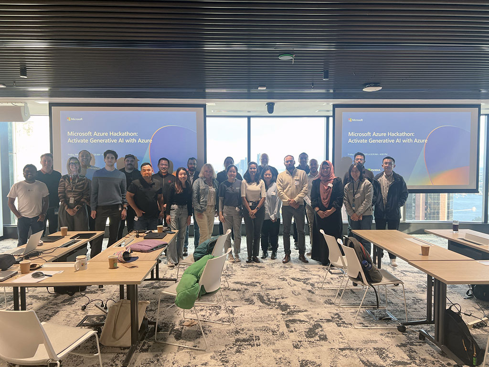
  

  

    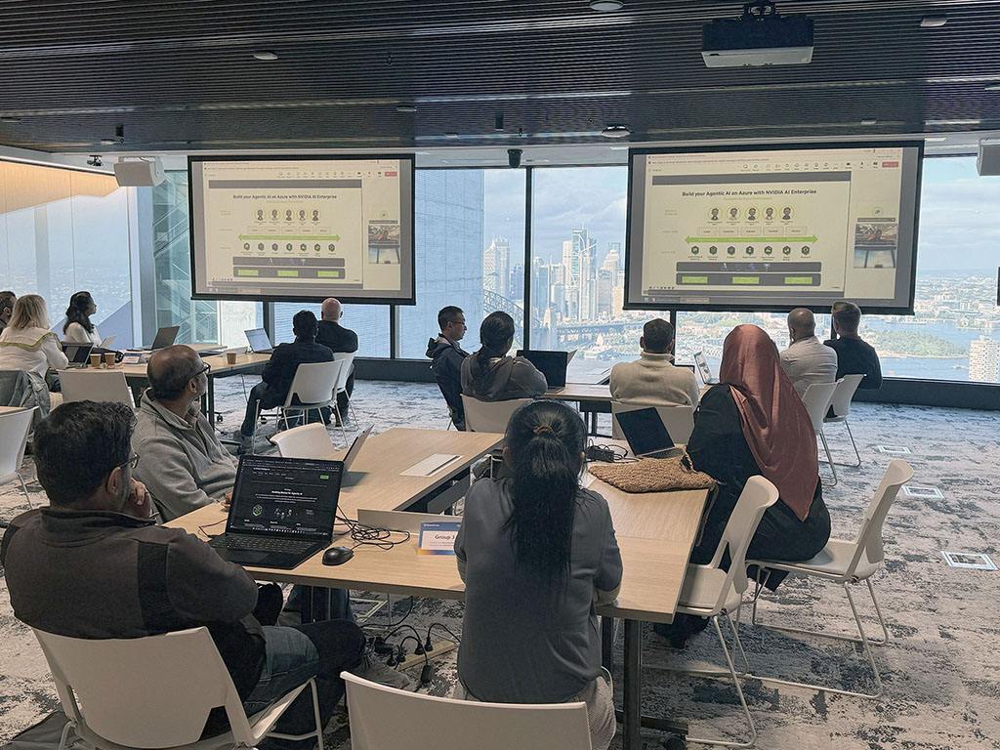
  

  

    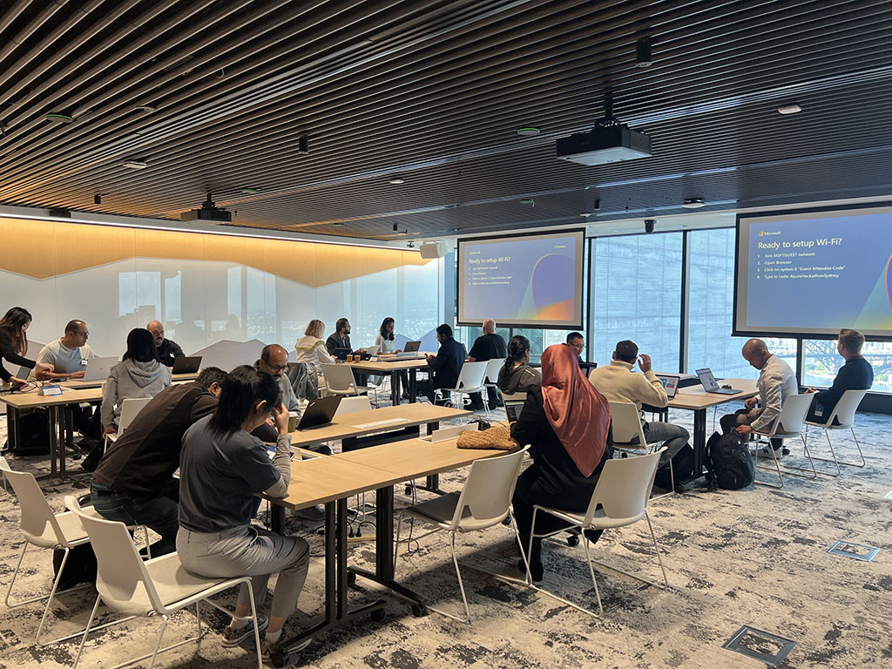
  

  

    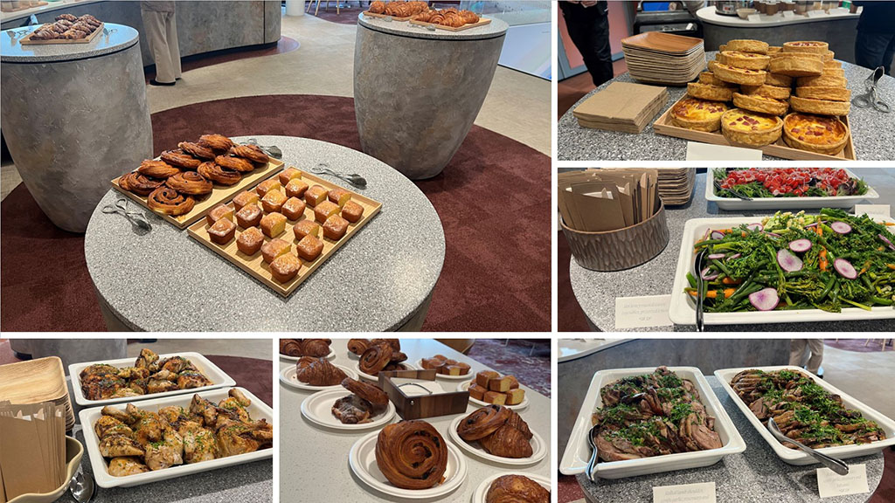
  

  

    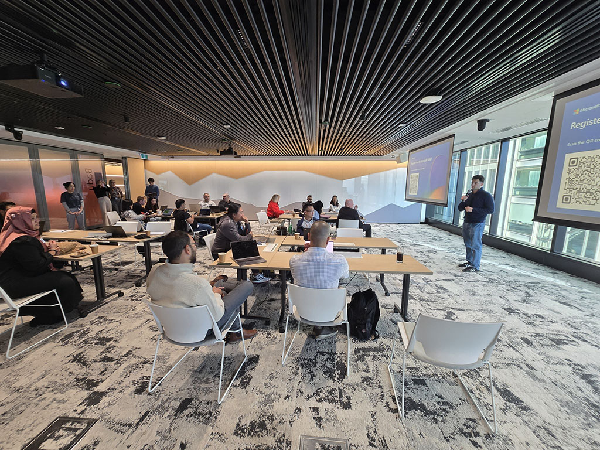
  

  

    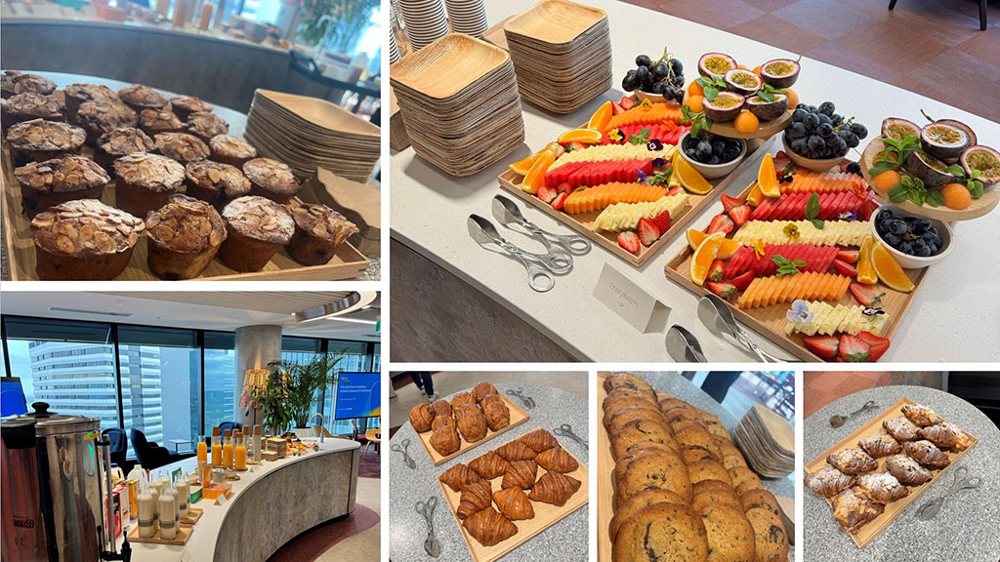
  

  

    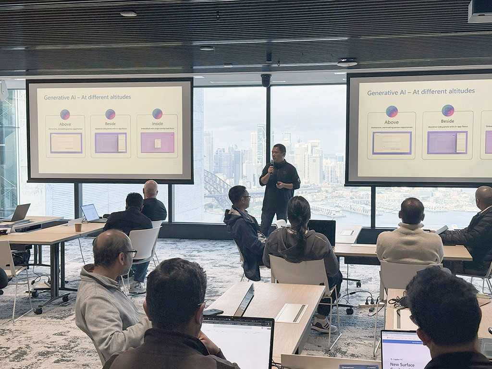
  

  

    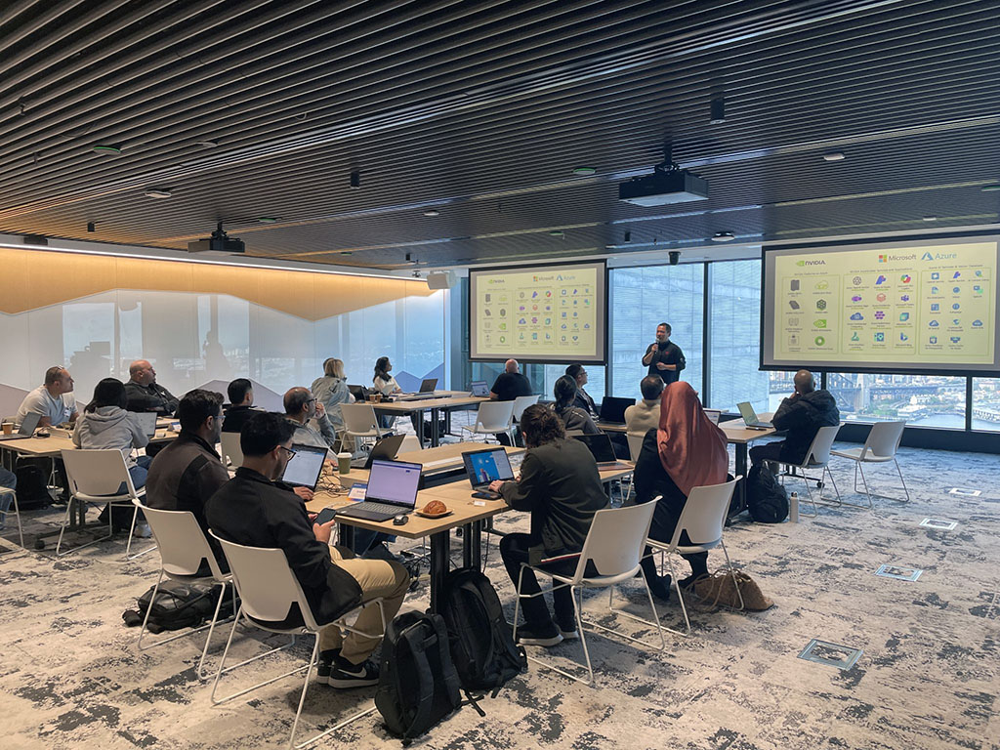
  

  

    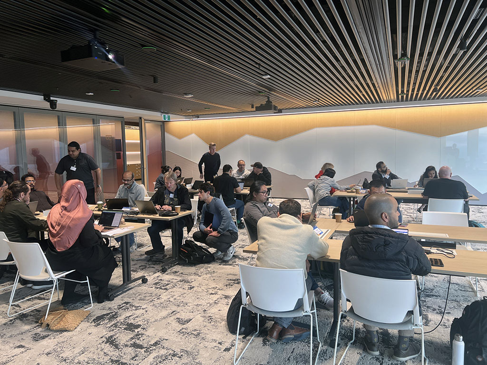
  

  

    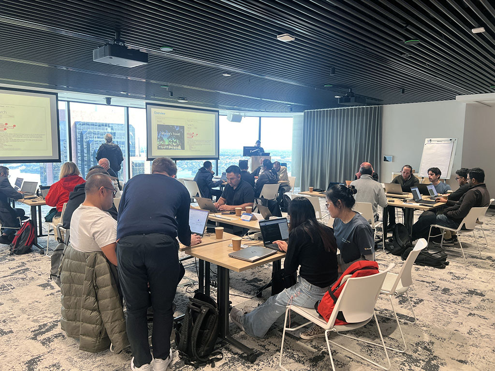
  

  

    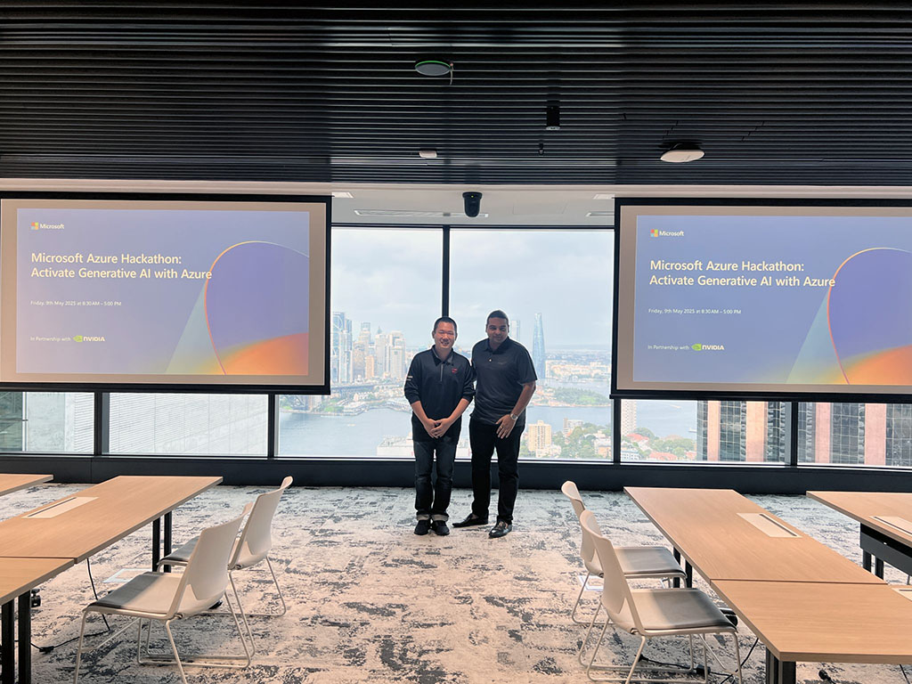
  

  

    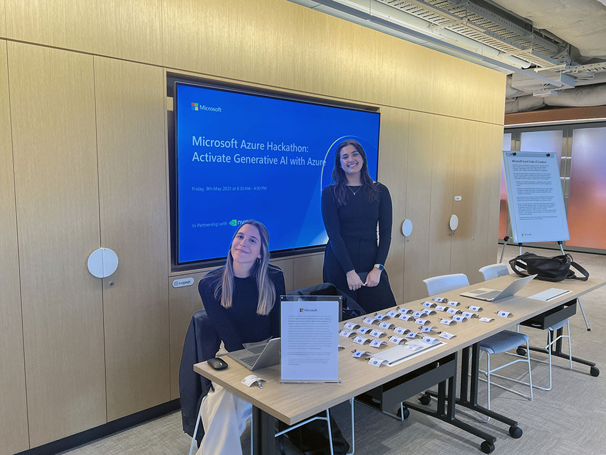
  

  

    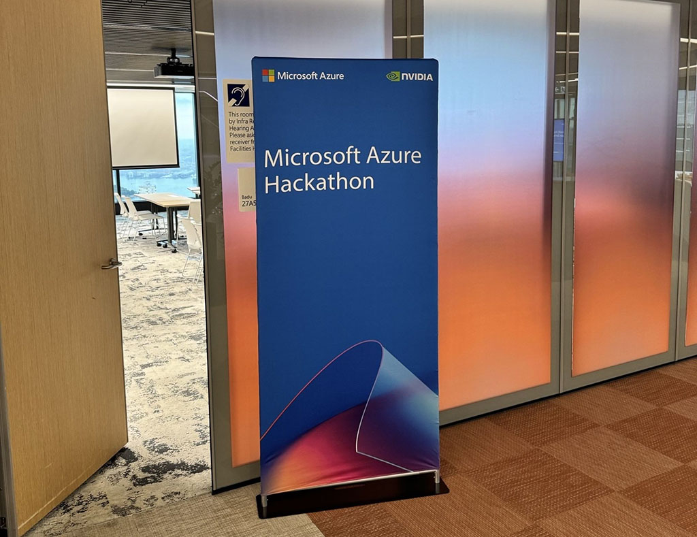
  

<a href="https://www.linkedin.com/posts/qkfang_azure-nvidia-ai-activity-7329475032848498688-zEU6" target="_blank">Read more via LinkedIn Post</a>
