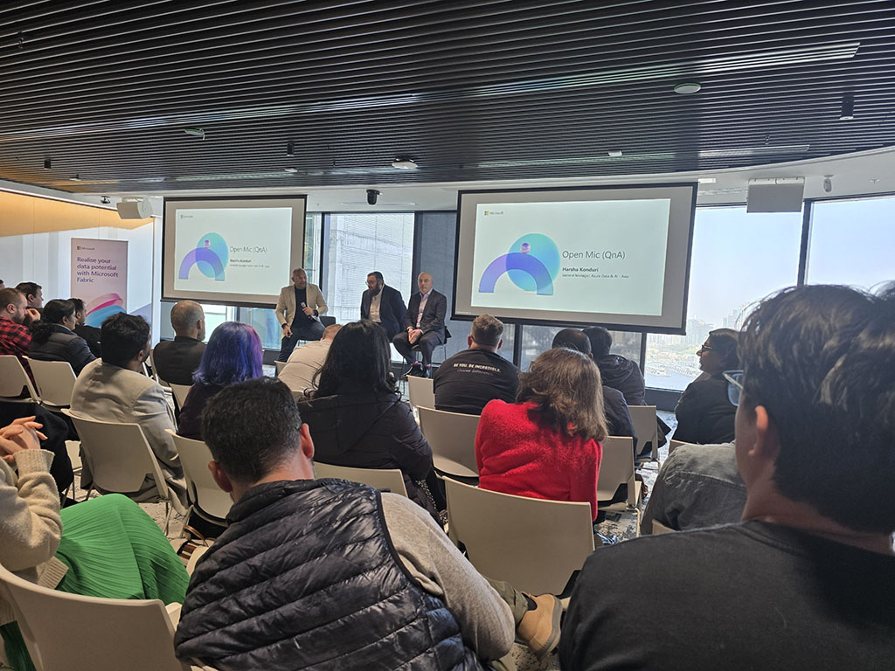
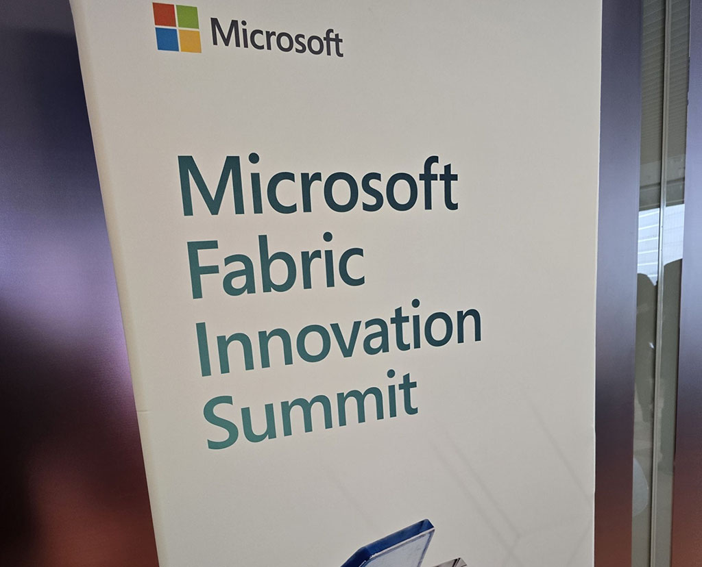
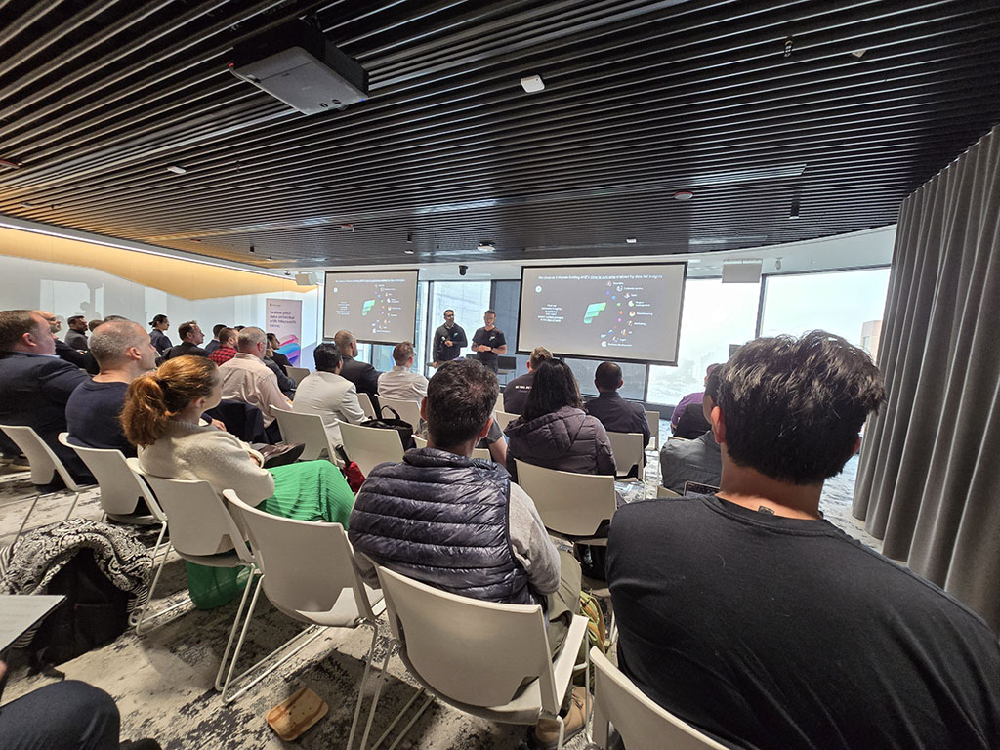
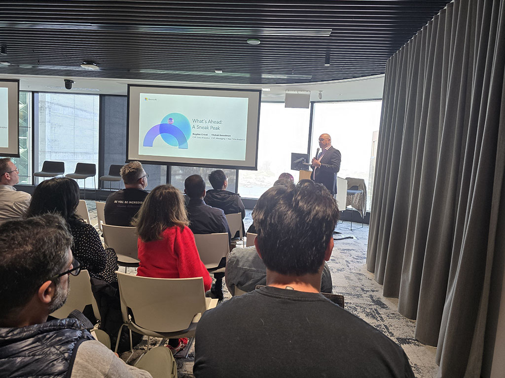
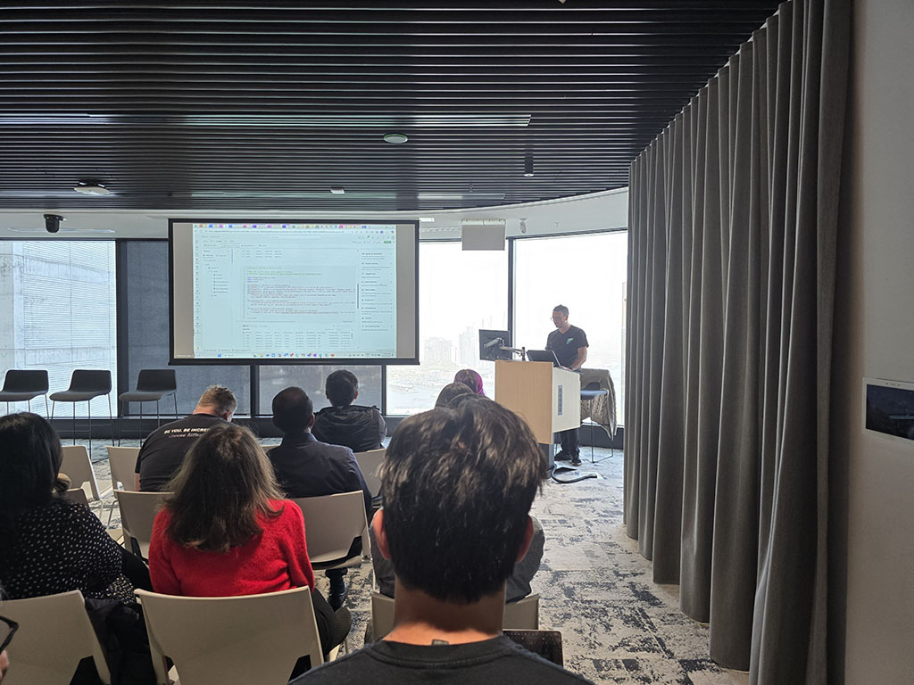

✨ Spent the morning at Microsoft Fabric Innovation Summit in Microsoft’s North Sydney office, and the room was fully packed! From Fabric's real-time intelligence ⚡to agent & copilot-infused experiences 🤖, every demo showcased how hashtag#Fabric is re-imagining data & AI for the enterprise. 

Insightful presentations and demos from Vyas and Francesco-Giorgio, especially the demos of integrating AI into batch processing and data streaming. It was great to see how easy it is to leverage hashtag#Copilot and hashtag#DataAgent with just a few clicks! ✨

We were fortunate to have Bogdan, Yitzhak and Harsha in the room, sharing their vision for Fabric's future 🔮, unveiling upcoming features & product roadmap, and open QnA. Great questions from everyone, especially Ali's, bringing our customers' day-to-day needs right into the discussion. 🧩

The event reminded me of my data analysis, reporting, and performance-tuning days from ten years ago. Fun fact 😄: I'm an old-school Microsoft Certified Master for hashtag#SQLServer, one of those folks who survived the eight-hour live lab test on SQL performance tuning! 💪

Kudos to the Microsoft team (Clare, Jeanne, Elizabeth and more) for bringing the energy and insights of hashtag#FabCon from Las Vegas to Australia! 

Everyone left inspired 🚀, with a Jupyter notebook full of ideas to accelerate our own data & AI roadmap. 📓

  

    
  

  

    
  

  

    
  

  

    
  

  

    
  

<a href="https://www.linkedin.com/posts/qkfang_fabric-copilot-dataagent-activity-7333085536925978624-PwLe" target="_blank">Read more via LinkedIn Post</a>
