Application Modernisation & hashtag#GenAI Hackathon powered by NVIDIA & Microsoft Azure!🚀 Microsoft North Sydney office was once again packed and buzzing with passionate app dev creators last Monday with a spectacular (and misty! 🌫️) morning! We dived hands-on into our App Modernisation hashtag#Hackathon💻, making it super practical and featuring exciting new announcements straight from Microsoft Build! 📣

Dimitri kicked things off with an epic intro to NVIDIA's hashtag#GenAI services and offerings (NVIDIA AI Enterprise, hashtag#NIM, hashtag#Nemo framework, and heaps of awesome models). Then we rolled up our sleeves: transforming a monolithic app into sleek frontend and backend containers📦, and deploying them as Azure hashtag#ContainerApps. But we didn’t stop there: next up was deploying the NVIDIA hashtag#Riva voice model using hashtag#VMI, hosted on hashtag#Azure, and building an hashtag#AI orchestration workflow using hashtag#PromptFlow on hashtag#AzureAIFoundry that brought together voice🎤, hashtag#AzureAISearch 🔍, and a hashtag#PostgreSQL database into one smart (and hilariously witty!) hashtag#chatbot. 🤖

💡The best part? It wasn't just about cutting-edge tech, we witnessed real teamwork and creativity in action! From curious questions to out-of-the-box solutions, the room turned into a melting pot of ideas, innovation, and laughter. Whether you came to learn, to hack, or just for the snacks🍪, you helped make the event a win for everyone.

🎉Huge thanks to everyone who joined us, asked questions, shared ideas, and persevered through the fog and the bugs! Special shoutout to the dedicated folks who made the trip from Canberra. Proof that nothing, not even the thickest Sydney mist, can stop our passion and innovation!🔥

Big thanks to Clare, Richa, Jamie, Agustina, Aymee for organizing the fantastic event, and to Ross, Katherine, and Olaf as our superstar instructors for the day! 🌟

  

    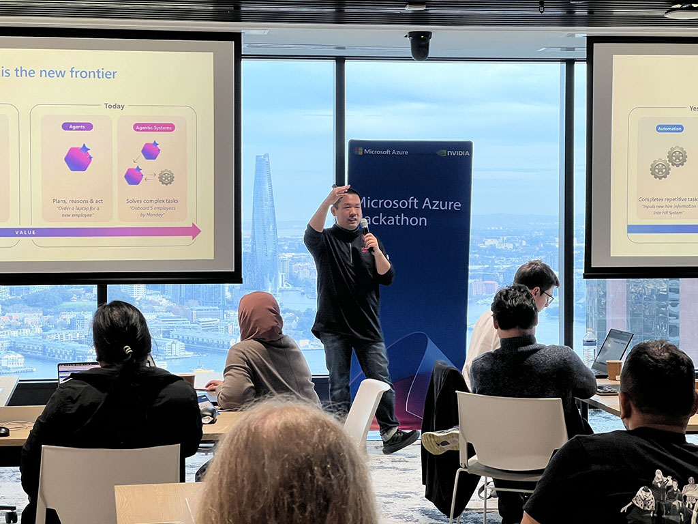
  

  

    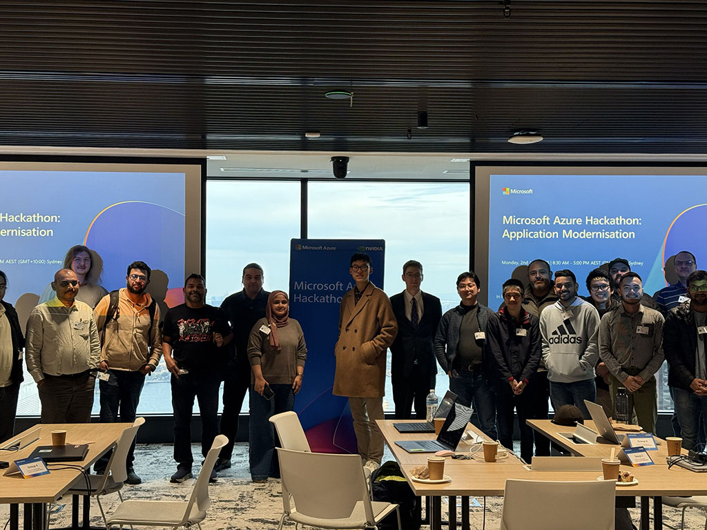
  

  

    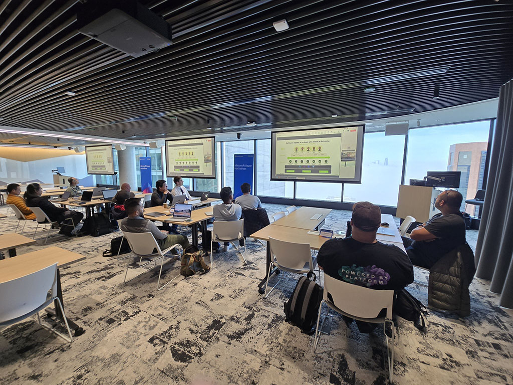
  

  

    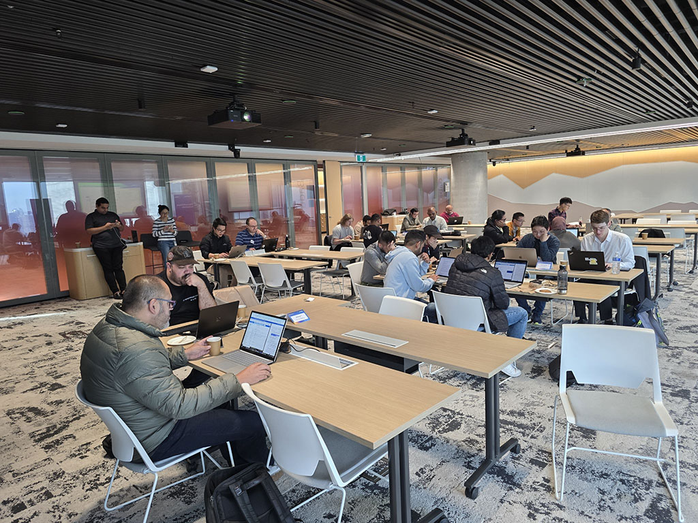
  

  

    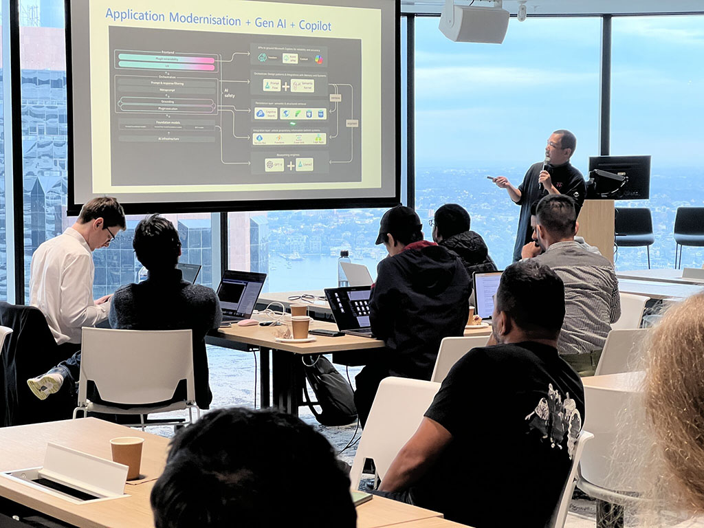
  

  

    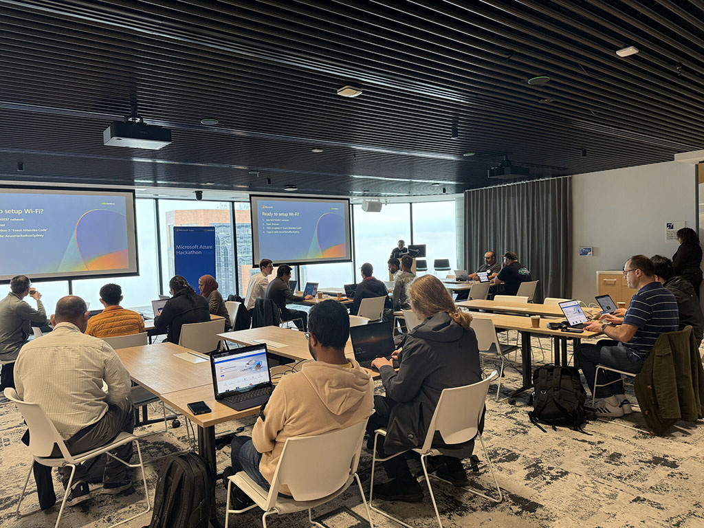
  

  

    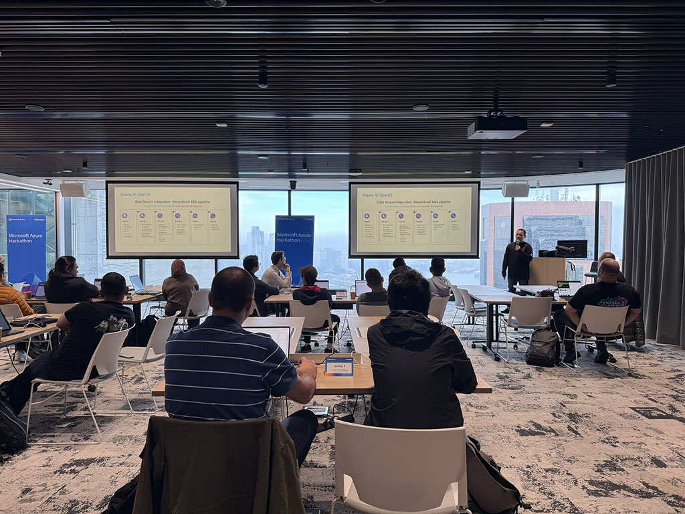
  

  

    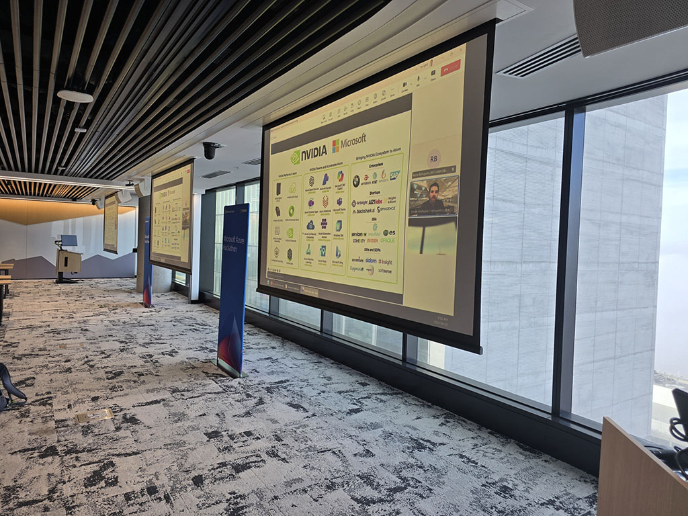
  

  

    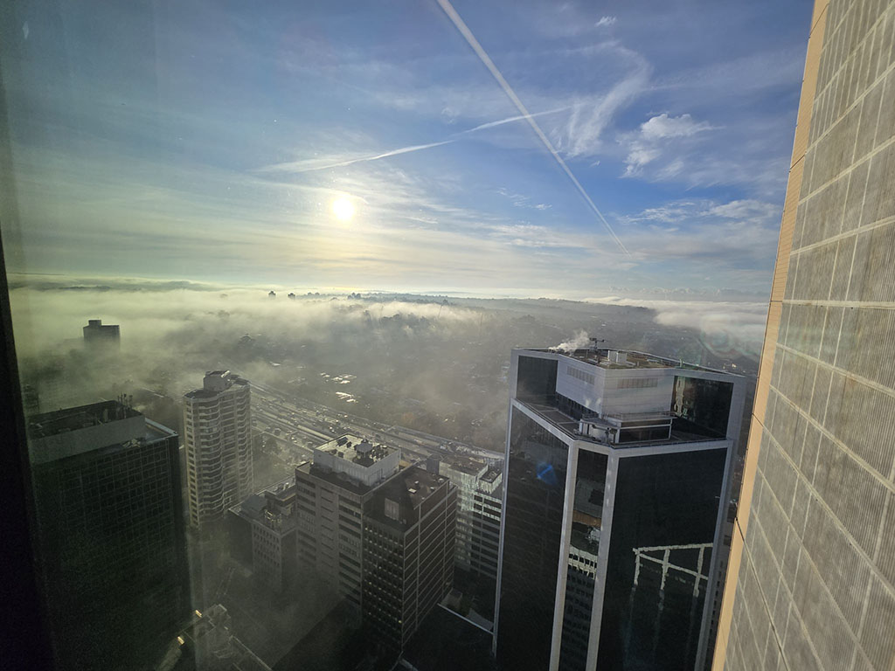
  

  

    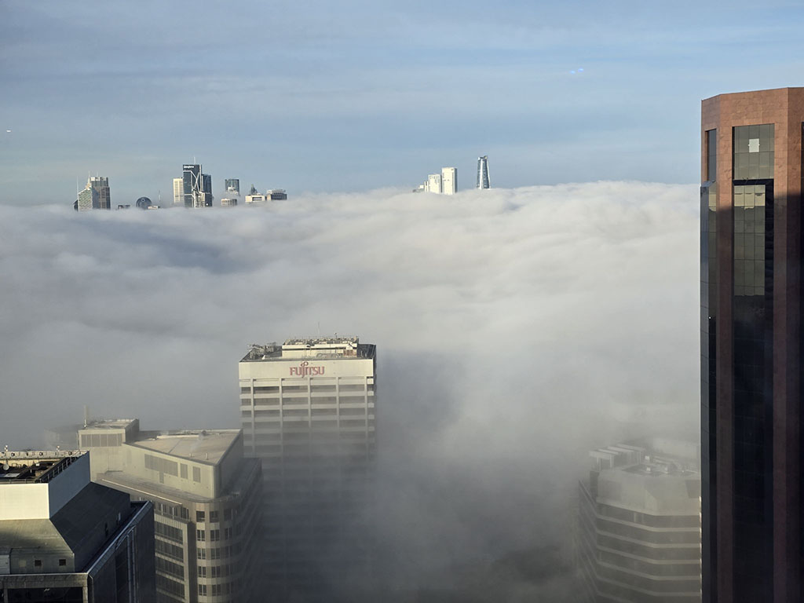
  

  

    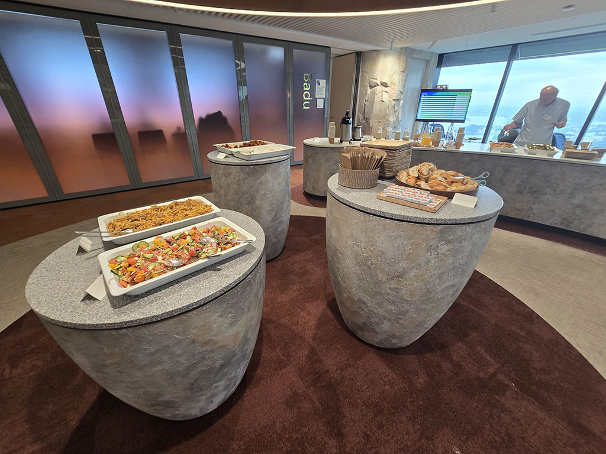
  

  

    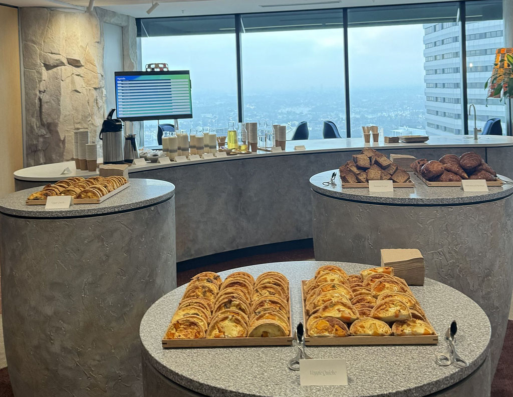
  

  

    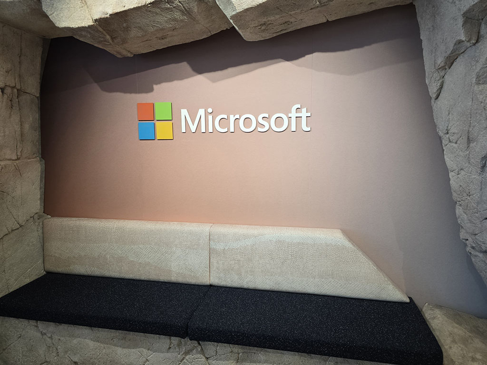
  

<a href="https://www.linkedin.com/posts/qkfang_genai-hackathon-genai-activity-7336991473579544576-4TxS" target="_blank">Read more via LinkedIn Post</a>
