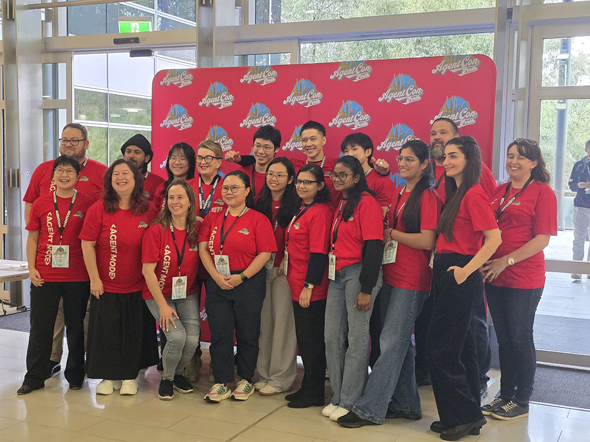
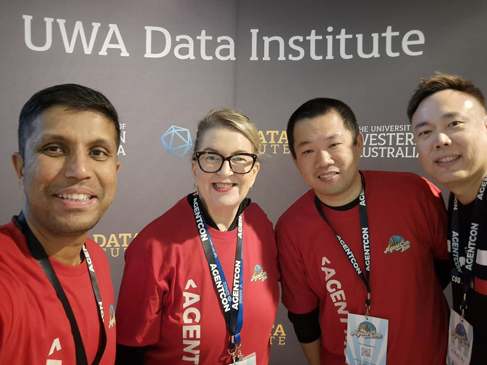

🏖️ Agentic LEGO Robotics talk at hashtag#AgentCon hashtag#Perth - my day trip to West Coast adventure with over 350 passionate participants! 🤖 What a cracker of a Friday it was! My first-ever talk on the west coast, and you all made it unforgettable. While Sydney shivered at 6°C ❄️, sunny Perth turned it on with huge crowd of amazing people for AI conference. 

I shared the journey📍of building our real-world hashtag#LEGO hashtag#robotics hashtag#agent: a goal-based, multi-agent, functional team of AI agents controlling a LEGO Spike Prime robot. Think of it as LEGO mini-figure engineers who powering the real-world robots.

Here's the agent lineup:
🎮 Controller Agent – Commands the LEGO Spike via hashtag#Bluetooth + hashtag#MCP
👀 Observer Agent – hashtag#YOLO object detection + video streaming (coded by hashtag#GitHub hashtag#Copilot!)
🧭 Planner Agent – Builds action plans using a knowledge base + hashtag#python code library
✅ Judger Agent – Confirms if goals are actually met 
👩‍✈️ Orchestrator Agent – Keeps the whole squad in check
🎤 Voice Agent – Talks to humans like a pro
💻 Interactive UI – Pulls back the curtain so humans can stay in the loop

All this was powered by:
🧠 hashtag#SemanticKernel + hashtag#AzureAIFoundry agent services on Microsoft Azure 
🧱 LEGO Spike Prime 3 from LEGO Education 
🌊 Stories from our robotic team during the FIRST Australia FFL Submerged season

🎙️I also soaked in incredible talks from speakers across hashtag#Australia – so much talent in all 3 tracks from 24 talks in one day! 💡💬
- Welcome by Michael from UWA DI
- Introductory Keynote by David
- Let Me Tell You About Your Future 🔮 by Jiaranai
- Getting Started with AI Agents by Vanessa
- Azure MCP is the Connector You've Been Waiting For by Daniella
- From Bots to Brains: Patterns for Building Intelligent AI Agents by Rakesh
- MCP and A2A. Bringing some order to the chaos by Graeme
- Agent Architects: Building Smarter Brains, One Demo at a Time by Sammy
- From prompt to protocol, securing AI agents and MCP, George Coldham
Building Trustworthy AI Agents by Michelle
- Live Coding an AI agent by Phil

🎉Huge thanks to the fantastic Global AI Perth organisers (Michelle, George, Julianne, Sabrina, Amy, Dinusha) and all the volunteers like Louisa for making it all happen. So great meeting ex-Insight friends Andreas & Rakesh. 🤝

hashtag#Perth, you were brilliant 🌟. Now that my 'crazy' mind knows a day trip across the country is an option! See you next time. 😎✈️

P.S. Don't forget to watch hashtag#LEGOMasters: Grand Masters of the Galaxy on Nine. 

<a href="https://www.linkedin.com/posts/qkfang_agentcon-perth-lego-activity-7342369868995772416-dmLc" target="_blank">Read more via LinkedIn Post</a>
